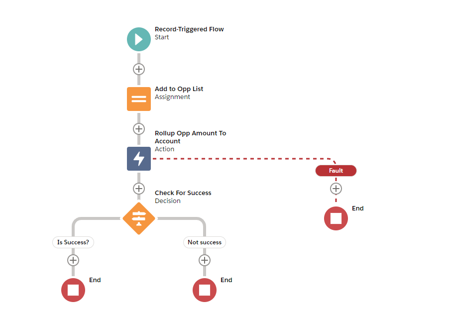

# Apex Rollup

<a href="https://githubsfdeploy.herokuapp.com">
  
</a>

Create fast, scalable custom rollups driven by Custom Metadata in your Salesforce org with `Rollup`. As seen on [Replacing DLRS With Custom Rollup](https://www.jamessimone.net/blog/joys-of-apex/replacing-dlrs-with-custom-rollup/)!

## Usage

You have several different options when it comes to making use of `Rollup`:

- The Custom Metadata-driven solution: install with _one line of code_
- From Flow / Process builder using the included invocable action
- Via a scheduled job, created by running some Anonymous Apex

### CMDT-based Rollup Solution:

All you need is one line of code in any trigger where you'd like to perform rollups to a "parent" object. If you were taking values from your Opportunity records and rolling some of them up to the Account, this single line would be put into your `Opportunity.trigger` file or within your Opportunity Handler class:

```java
// in a trigger. after insert, after update, and before delete are required to be listed on your trigger in order for this to work properly
Rollup.runFromTrigger();
```

Let me repeat: you **must** have the following contexts listed on your trigger:

```java
trigger ExampleTrigger on Opportunity(after insert, after update, before delete) {
  Rollup.runFromTrigger();
  // etc. You can invoke the above from your handler if you have one
}
```

That's it! Now you're ready to configure your rollups using Custom Metadata:

Within the `Rollup__mdt` custom metadata type, add a new record with fields:

- `Calc Item` - in this case, Oppportunity
- `Rollup Field On Calc Item` - the API Name of the field you’d like to aggregate (let's say Amount)
- `Lookup Field On Calc Item`- the API Name of the field storing the Id or String referencing a unique value on another object (In the example, Id)
- `Lookup Field On Lookup Object` - the API Name of the field on the lookup object that matches the value stored in `Lookup Field On Calc Item`
- `Rollup Field On Lookup Object` - the API Name of the field on the lookup object where the rolled-up values will be stored (I've been using AnnualRevenue on the account as an example)
- `Lookup Object` - the name of the SObject you’d like to roll the values up to (in this case, Account)
- `Rollup Type` - the operation you're looking to perform. Acceptable values are SUM / MIN / MAX / AVERAGE / COUNT / COUNT_DISTINCT / CONCAT
- `Changed Fields On Calc Item` (optional) - comma-separated list of field API Names to filter items from being used in the rollup calculations unless all the stipulated fields have changed

You can perform have as many rollups as you'd like per object/trigger -- all operations are batched.

#### Establishing Org Limits For Rollup Operations

When you install `Rollup`, you get two custom metadata types - `Rollup__mdt`, describe above, and `RollupLimit__mdt`. The latter can be used in three different ways:

1. if you're using the CMDT trigger-based approach highlighted above to manage your rollups, you can tie the `RollupLimit` record to an individual `Rollup` record
2. if you're using an invocable/scheduled/custom Apex-based approach, you can use specific patterns to match on the rollup being performed
3. you can create a record with the API Name `Org_Defaults` to specify master-level overrides for your rollups

These are the fields on the `Rollup Limit` custom metadata type:

- `Max Lookup Rows Before Batching` - if you are rolling up to an object that interacts in many different ways within the system, `Rollup` moves from using a Queueable based system (read: fast and light) to a Batched Apex approach (read: solid, sometimes slow). You can override the default for switching to Batch Apex by lowering the number of rows. Without an `Org_Default` record, this defaults to `3333`
- `Max Lookup Rows For Queueable` - if you haven't selected a Batch Apex override, defaults to `5000`
- `Rollup` lookup field to the `Rollup__mdt` metadata record. Optional.
- `Should Abort Run` - if done at the `Org_Defaults` level, completely shuts down all rollup operations in the org. Otherwise, can be used on an individual rollup basis to turn on/off.
- `Should Run As Batchable` - if enabled, is the preferred method for running rollup operations. You can only set this or `Should Run As Queueable` to true at once.
- `Should Run As Queueable` - by default, rollup operations run as Queueables until the aforementioned `5000` record limit unless `Should Run As Batchable` is set to true
- `Trigger Or Invocable Name` - If you are using custom Apex, a schedulable, or rolling up by way of the Invocable action and can't use the `Rollup` lookup field. Use the pattern `trigger_fieldOnCalcItem_to_rollupFieldOnTarget_rollup` - for example: 'trigger_opportunity_stagename_to_account_name_rollup' (use lowercase on the field names). If there is a matching Rollup Limit record, those rules will be used. The first part of the string comes from how a rollup has been invoked - either by `trigger`, `invocable`, or `schedule`. A scheduled flow still uses `invocable`!

### Flow / Process Builder Invocable

I will touch only on Flows given that all indications from Salesforce would lead a person to believe they are the future of the "clicks" part in "clicks versus code":

Invoking the `Rollup` process from a Flow, in particular, is a joy; with a Record Triggered Flow, you can do the up-front processing to take in only the records you need, and then dispatch the rollup operation to the `Rollup` invocable:



This is also the preferred method for scheduling; while I do expose the option to schedule a rollup from Apex, I find the ease of use in creating Scheduled Flows in conjunction with the deep power of properly configured Invocables to be much more scalable than the "Scheduled Jobs" of old. This also gives you the chance to do some truly crazy rollups -- be it from a Scheduled Flow, an Autolaunched Flow, or a Platform Event-Triggered Flow. As long as you can manipulate data to correspond to the shape of an existing SObject's fields, they don't even have to exist; you could have an Autolaunched flow rolling up records when invoked from a REST API so long as the data you're consuming contains a String/Id matching something on the "parent" rollup object.

Here are the arguments necessary to invoke `Rollup` from a Flow / Process Builder:

- `Object for "Records To Rollup" (input)` - comes from your calculation items, and their SObject type should be selected accordingly. If you are rolling up from Opportunity to Account, you would select Opportunity as the type
- `Records To Rollup` - a collection of SObjects. These need to be stored in a collection variable
- `Calc Item Rollup Field` - the API Name of the field you’d like to aggregate (let's say Amount)
- `Lookup Field On Calc Item`- the API Name of the field storing the Id or String referencing a unique value on another object (In the example, Id)
- `Lookup Field On Lookup Object` - the API Name of the field on the lookup object that matches the value stored in `Lookup Field On Calc Item`
- `Rollup Field On Lookup Object` - the API Name of the field on the lookup object where the rolled-up values will be stored (I've been using AnnualRevenue on the account as an example)
- `Rollup Context` - INSERT / UPDATE / DELETE
- `Rollup Operation` - the operation you're looking to perform. Acceptable values are SUM / MIN / MAX / AVERAGE / COUNT / COUNT_DISTINCT / CONCAT
- `Calc item changed fields` (optional) - comma-separated list of field API Names to filter items from being used in the rollup calculations unless all the stipulated fields have changed

Unfortunately, the "Description" section for Invocable fields does not show up as help text within the Flow Builder, but hopefully it's clear how each property should be configured!

### Scheduled Job

You can use the following Anonymous Apex script to schedule rollups:

```java
// Method signature: (String jobName, String cronExp, String query, List<Id> rollupMetadataIds, Evaluator eval)
Rollup.schedule(
  'My example job name',
  'my cron expression, like 0 0 0 * * ?',
  'my SOQL query, like SELECT Id, Amount FROM Opportunity WHERE CreatedDate > YESTERDAY',
  new List<Id>{ 'The ids of Rollup__mdt records configuring the rollup operation' },
  null
);
```

That last argument - the `null` value - has to implement an interface called `Evaluator` (or it can just be left null). More on that below.

## Custom Apex Rollups

If the CMDT-based or other solutions won't cut it and you need more customizability, there's an extensive API surface exposed by `Rollup` using public static helper methods:

```java
// you can batch rollup operations into one!
Rollup.batch(
  Rollup.countDistinctFromTrigger(Opportunity.Amount, Opportunity.AccountId, Account.Id, Account.NumberOfEmployees, Account.SObjectType),
  Rollup.sumFromTrigger(Opportunity.Amount, Opportunity.AccountId, Account.Id, Account.AnnualRevenue, Account.SObjectType)
);

// you could even batch multiple batches (not sure why you would do this, but it's technically supported!!)
Rollup.batch(
  Rollup.batch(
    // ... it's batches all the way down!
    Rollup.countDistinctFromTrigger(Opportunity.Amount, Opportunity.AccountId, Account.Id, Account.NumberOfEmployees, Account.SObjectType),
    Rollup.sumFromTrigger(Opportunity.Amount, Opportunity.AccountId, Account.Id, Account.AnnualRevenue, Account.SObjectType)
  ),
  // don't actually do this, please
  Rollup.average(Opportunity.CloseDate, Opportunity.Id, Lead.ConvertedDate, Lead.ConvertedOpportunityId, Lead.SObjectType)
)
```

The following methods are exposed:

```java
// in Rollup.cls

public static void batch(Rollup rollup, Rollup secondRollup)
public static void batch(Rollup rollup, Rollup secondRollup, Rollup thirdRollup)
public static void batch(List<Rollup> rollups)
public static Rollup runCalc() // more on this method below

public static Rollup averageFromTrigger(
  SObjectField averageFieldOnCalcItem,
  SObjectField lookupFieldOnCalcItem,
  SObjectField lookupFieldOnOperationObject,
  SObjectField averageFieldOnOperationObject,
  SObjectType lookupSobjectType
)

public static Rollup countDistinctFromTrigger(
  SObjectField countDistinctFieldOnCalcItem,
  SObjectField lookupFieldOnCalcItem,
  SObjectField lookupFieldOnOperationObject,
  SObjectField countDistinctFieldOnOperationObject,
  SObjectType lookupSobjectType
)

public static Rollup concatFromTrigger(
  SObjectField concatFieldOnCalcItem,
  SObjectField lookupFieldOnCalcItem,
  SObjectField lookupFieldOnOperationObject,
  SObjectField concatFieldOnOperationObject,
  SObjectType lookupSobjectType
)

public static Rollup countFromTrigger(
  SObjectField countFieldOnCalcItem,
  SObjectField lookupFieldOnCalcItem,
  SObjectField lookupFieldOnOperationObject,
  SObjectField countFieldOnOperationObject,
  SObjectType lookupSobjectType
)

public static Rollup maxFromTrigger(
  SObjectField maxFieldOnCalcItem,
  SObjectField lookupFieldOnCalcItem,
  SObjectField lookupFieldOnOperationObject,
  SObjectField maxFieldOnOperationObject,
  SObjectType lookupSobjectType
)

public static Rollup minFromTrigger(
  SObjectField minFieldOnCalcItem,
  SObjectField lookupFieldOnCalcItem,
  SObjectField lookupFieldOnOperationObject,
  SObjectField minFieldOnOperationObject,
  SObjectType lookupSobjectType
)

public static Rollup sumFromTrigger(
  SObjectField sumFieldOnCalcItem,
  SObjectField lookupFieldOnCalcItem,
  SObjectField lookupFieldOnOperationObject,
  SObjectField sumFieldOnOpOject,
  SObjectType lookupSobjectType
)

//for using as the "one line of code" and CMDT-driven rollups
public static void runFromTrigger()
```

All of the "...fromTrigger" methods shown above can also be invoked using a final argument, the `Evaluator`:

```java
public interface Evaluator {
  Boolean matches(Object calcItem);
}
```

By implementing this interface in a concrete class and then passing an instance of that class to `Rollup`, you can codify advanced business logic within Apex to drive which records classify for rollups:

```java
// assuming you are using this with opportunities:

public class OpportunityNameEvaluator implements Rollup.Evaluator {
  public Boolean matches(Object calcItem) {
    if((calcItem instanceof Opportunity) == false) {
      return false;
    }

    Opportunity opp = (Opportunity) calcItem;
    return opp.Name.contains('Business Development');
  }
}

// and an example usage:

Rollup.sumFromTrigger(
  Opportunity.Amount
  Opportunity.AccountId,
  Account.Id,
  Account.AnnualRevenue,
  Account.SObjectType,
  new OpportunityNameEvaluator()
).runCalc();
```

It's that simple. Note that in order for custom apex solutions that don't use the `batch` static method on `Rollup` to properly start, the `runCalc()` method must also be called. That is, if you only have one rollup operation per object, you'll _always_ need to call `runCalc()` when invoking `Rollup` from a trigger.

## Special Considerations

While pains have been taken to create a solution that's truly one-sized-fits-all, any professional working in the Salesforce ecosystem knows that it's difficult to make that the case for any product or service - even something open-source and forever-free, like `Rollup`. All of that is to say that while I have tested the hell out of `Rollup` and have used it already in production, your mileage may vary depending on what you're trying to do. Some operations that are explicitly not supported within the SOQL aggregate functions (like `SELECT MIN(ActivityDate) FROM Task`) are possible when using `Rollup`. Another example would be `MAX` or `MIN` operations on multi-select picklists. I don't know _why_ you would want to do that ... but you can!

### Picklists

Picklists are a loaded topic in Salesforce. They're not only dropdowns, but the order is supposed to matter! MIN/MAXING on a picklist is supposed to return the deepest possible entry in the picklist (for MAX), or the closest to the top of the picklist (for MIN). If you've studied the aggregate function documentation thoroughly in the Salesforce Developer Docs, this will comes as no surprise - but because the ranking system for picklist differs from the ranking system for other pieces of text, I thought to call it out specifically.

## Commit History & Contributions

This repository comes after the result of [dozens of commits](https://github.com/jamessimone/apex-mocks-stress-test/commits/rollup) on my working repository. You can view the full history of the evolution of `Rollup` there.

On the subject of contributing ([also covered in the Contributing doc](./Contributing.md)), I'm open to collaborating! Please make sure you install this repo's dependencies using NPM or Yarn:

```bash
yarn
# or
npm -i
```

I use Prettier in conjunction with the prettier-apex plugin for formatting Apex. There are (hopefully) minor stylistic choices that I have made and hope any contributors will respect when modifying the code:

- Format On Save. I let Prettier do all the heavy lifting
- Column length (set in `.prettierrc`) is set to `160`. That's a _little_ wide for laptop developers. I know, as I've spent a good portion of time on my personal Thinkpad working on this project. Still, for a desktop it's perfect for reducing lines of code. Forgive me.
- Spaces ... are .... set to `2`. Pretty unusual for Java-ish languages, but as I am looking to keep this all in one class, it really helped with increasing readability / reducing LOC

## Roadmap

Forthcoming. Drop me <a href="mailto:james@sheandjim.com" title="Email me">a line</a>, <a title="contact me" href="https://www.jamessimone.net/contact/">contact me online</a> or raise an issue here with questions.
