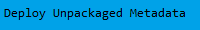

# Apex Rollup

[](https://github.com/jamessimone/apex-rollup/actions/workflows/deploy.yml 'Click to view deployment pipeline history')
[](https://codecov.io/gh/jamessimone/apex-rollup)

Create fast, scalable custom rollups driven by Custom Metadata in your Salesforce org with `Rollup`. As seen on [Replacing DLRS With Custom Rollup](https://www.jamessimone.net/blog/joys-of-apex/replacing-dlrs-with-custom-rollup/)! As of [v1.2.0](https://github.com/jamessimone/apex-rollup/releases/tag/v1.2.0), `Rollup` also offers [the ability to roll directly up from children records to grandparent (or greater!) records](#grandparent-rollups), without needing complex hierarchical intermediate fields.

## Deployment

### Package deployment options

<a href="https://login.salesforce.com/packaging/installPackage.apexp?p0=04t6g000008SgcyAAC">
  
</a>

<a href="https://test.salesforce.com/packaging/installPackage.apexp?p0=04t6g000008SgcyAAC">
  
</a>

<br/>
<br/>

### Deploy just the source code

<a href="https://githubsfdeploy.herokuapp.com?owner=jamessimone&repo=apex-rollup&ref=main">
  
</a>

## Setup

As of [v1.2.2](https://github.com/jamessimone/apex-rollup/releases/tag/v1.2.2), `Rollup` now ships with a custom hierarchy setting, `Rollup Settings`, which you will have to create an Org Wide Default entry for by going to:

1. Setup
2. Custom Settings
3. Click `Manage` next to the `Rollup Settings` entry
4. Click `New` at the top to enter the Org Wide Defaults section - check off the `Is Enabled` field (it should be enabled by default) and click `Save`

While you can still enable/disable individual rollups from running with the use of the `Rollup Control` CMDT (more details on that further on in the Readme), using a custom setting allows for several features that CMDT-based solutions currently lack:

- ease of installation/upgrade. Previously some users had issues when installing/upgrading due to pre-existing automation in their orgs interfering with the `Rollup` tests
- granularity of control. Want to disable rollups from running for a specific user or profile? Easy as pie!

### Migrating from DLRS

If you are converting from DLRS to Rollup, you can automatically convert all of your DLRS rules using the included Apex scripts:

1. [scripts/convert-dlrs-rules.apex](scripts/convert-dlrs-rules.apex). Simply run this script in your org, and most DLRS rules (stored in `dlrs__LookupRollupSummary2__mdt`) will be converted to `Rollup__mdt` records and automatically deployed to the current org. There are exclusions as described [in the Notes On The Use Of CMDT To Control Your Rollups](#notes-on-custom-metadata), for these the script will write out how to implement the flow action equivalent in the debug logs [for more information see here](#flow-process-builder-invocable).
2. [scripts/deactivate-converted-dlrs-rules.apex](scripts/deactivate-converted-dlrs-rules.apex). Once you've converted your `dlrs__LookupRollupSummary2__mdt` records into `Rollup__mdt` records, you can run this script to deactivate any converted DLRS rules in the current org. Please note that this script does not delete the existing DLRS rules, nor does it uninstall DLRS for you - after running it, you'll still have to clean up and remove DLRS from your org.

## Usage

You have several different options when it comes to making use of `Rollup`:

- The [Custom Metadata-driven solution](#cmdt-based-rollup): install with _one line of code_
- From Flow / Process builder using [the included invocable actions](#flow-process-builder-invocable)
- [One-off jobs, kicked off via the `Rollup` app](#calculating-rollup-after-install)
- [Using the included LWC button on a parent record's flexipage](#parent-record-recalc-button)
- [Via a scheduled job](#scheduled-jobs), created by running some Anonymous Apex

### CMDT-based Rollup Solution:

<div id="cmdt-based-rollup"></div>

All you need is one line of code in any trigger where you'd like to perform rollups to a "parent" object. If you were taking values from your Opportunity records and rolling some of them up to the Account, this single line would be put into your `Opportunity.trigger` file or within your Opportunity Handler class:

```java
// in a trigger. after insert, after update, before delete, and after undelete are REQUIRED
// to be listed on your trigger in order for this to work properly
Rollup.runFromTrigger();
```

Let me repeat: you **must** have the following contexts listed on your trigger:

```java
trigger ExampleTrigger on Opportunity(after insert, after update, before delete, after delete, after undelete) {
  // after delete is required ONLY if your org does Account / Contact / Lead / Case merges
  Rollup.runFromTrigger();
  // etc. You can invoke the above from your handler if you have one
}
```

To be clear - the following trigger contexts are necessary when using `runFromTrigger` on any trigger installing `Rollup`:

- after insert
- after update
- before delete
- after delete (**only necessary if your org does Account/Contact/Lead/Case merges** - repeated from the above comment). For more info please see [setting Rollup up to handle parent-level merges](#parent-level-merges)
- after undelete

This means that if you are invoking `Rollup.runFromTrigger();` from any other context (be it a quick action, LWC, Aura or wherever), nothing will happen; there won't be an error, but a rollup also won't be performed. For more information on one-off rollups, please see <a href="#calculating-rollup-after-install">Calculating Rollups After Install</a>.

The _only_ exception to the above is if you are using the `Is Rollup Started From Parent` checkbox field on the `Rollup__mdt` custom metadata (<a href="#rollup-metadata-details">more details on that below</a>). If the rollup starts from the parent, you are free to only list the trigger contexts that make sense for you - for example, if you are initiating a rollup from parent records and the children records whose values you are rolling up are only ever updated when the parent is being inserted, you are free to use `after insert` in your Apex trigger if you have no need of the other contexts.

That's it! Now you're ready to configure your rollups using Custom Metadata. `Rollup` makes heavy use of Entity Definition & Field Definition metadata fields, which allows you to simply select your options from within picklists, or dropdowns. This is great for giving you quick feedback on which objects/fields are available without requiring you to know the API name for every SObject and their corresponding field names.

#### Special Considerations For Use Of Custom Fields As Rollup/Lookup Fields

One **special** thing to note on the subject of Field Definitions — custom fields/objects referenced in CMDT Field Definition fields are stored in an atypical way, and require the usage of an additional SOQL query as part of `Rollup`'s upfront cost. A typical `Rollup` operation will use `2` SOQL queries per rollup — the query that determines whether or not a job should be queued or batched, and a query to get the `Rollup__mdt` custom metadata. Though it's true that since Spring 21, it's possible to retrieve CMDT straight from the cache without consuming a SOQL query, Custom Metadata Types retrieved from the cache don't have their parent-level fields initialized, which makes it impossible to massage the data into a usable shape within the rest of `Rollup`. Additionally, if your `Calc Item Where Clause` contains a reference to a polymorphic field (like `What.Type` or `Owner.Name` or `What.Type` etc ...), an extra query will be consumed prior to `Rollup` going async to ensure that only matching items are passed along to be rolled up.

If the SOQL queries used by `Rollup` becomes cause for concern, please [submit an issue](/issues) and we can work to address it!

#### Special Considerations For Usage Of The Calc Item Where Clause

In addition to the above, some other considerations when it comes to the where clause:

Any time a polymorphic field is used in your `Calc Item Where Clause`, you must also have a constraint on the parent-level `Type` in order for it to work. If you are filtering on `Task.What`, for example, you must have only a single SObject-parent type as part of your where clause, e.g. `What.Name = 'someName' AND What.Type = 'Account'`.

#### Rollup Custom Metadata Field Breakdown

Within the `Rollup__mdt` custom metadata type, add a new record with fields:

<div id="rollup-metadata-details"/>

- `Calc Item` - the SObject the calculation is derived from — in this case, Oppportunity
- `Lookup Object` - the SObject you’d like to roll the values up to (in this case, Account)
- `Rollup Field On Calc Item` - the field you’d like to aggregate (let's say Amount)
- `Lookup Field On Calc Item`- the field storing the Id or String referencing a unique value on another object (In the example, Id)
- `Lookup Field On Lookup Object` - the field on the lookup object that matches the value stored in `Lookup Field On Calc Item`
- `Rollup Field On Lookup Object` - the field on the lookup object where the rolled-up values will be stored (I've been using AnnualRevenue on the account as an example)
- `Rollup Operation` - A picklist field to select the operation you're looking to perform. Acceptable values are SUM / MIN / MAX / AVERAGE / COUNT / COUNT_DISTINCT / CONCAT / CONCAT_DISTINCT / FIRST / LAST. Both CONCAT and CONCAT_DISTINCT separate values with commas by default in the rollup field itself, but you can use `Concat Delimiter` to change that.
- `Rollup Control` - link to the Org Defaults for controlling rollups, or set a specific Rollup Control CMDT to be used with this rollup. Multiple rollups can be tied to one specific Control record, or simply use the Org Default record (included) for all of your rollups.
- `Concat Delimiter` (optional) - for `CONCAT` and `CONCAT_DISTINCT` operations, the delimiter used between text defaults to a comma (unless you are rolling up to a multi-select picklist, in which case it defaults to a semi-colon), but you can override the default delimiter here. At this time, only single character delimiters are supported - please file [an issue](/issues) if you are looking to use multi-character delimiters!
- `Changed Fields On Calc Item` (optional) - comma-separated list of field API Names to filter items from being used in the rollup calculations unless all the stipulated fields have changed
- `Full Recalculation Default Number Value` (optional) - for some rollup operations (SUM / COUNT-based operations in particular), you may want to start fresh with each batch of calculation items provided. When this value is provided, it is used as the basis for rolling values up to the "parent" record (instead of whatever the pre-existing value for that field on the "parent" is, which is the default behavior). **NB**: it's valid to use this field to override the pre-existing value on the "parent" for number-based fields, _and_ that includes Date / Datetime / Time fields as well. In order to work properly for these three field types, however, the value must be converted into UTC milliseconds. You can do this easily using Anonymous Apex, or a site such as [Current Millis](https://currentmillis.com/).
- `Full Recalculation Default String Value` (optional) - same as `Full Recalculation Default Number Value`, but for String-based fields (including Lookup and Id fields).
- `Calc Item Where Clause` (optional) - add conditions to filter the calculation items that are used. **Note** - the fields, especially parent-level fields, _must_ be present on the calculation items or the filtering will not work correctly. As of [v1.0.9](https://github.com/jamessimone/apex-rollup/releases/tag/v1.0.9), nested conditionals (conditionals contained within parantheses) are supported. However, due to the orthogonal nature of deeply nested conditionals from the original problem area, it's entirely possible that some forms of nested conditionals will not work, or will work in unintended ways. Please [submit an issue](/issues) if you are using Rollup and experience issues with calculation items correctly being flagged / not flagged toward the rollup field. For currency or number fields with multiple decimals, keep in mind that however the number appears in a SOQL query (ie `4.00`) is the format that you should use when performing filtering; `Amount != 4` will not work if the value is stored as `4.00`. The only exception to this is zero; there, you are allowed to omit the decimal places.
- `Is Full Record Set` (optional, defaults to `false`) - by default, if the records you are passing in comprise the full set of child items for a given lookup item but none of them "qualify" to be rolled up (either due to the use of the Calc Item Where Clause, Changed Fields On Calc Item, or a custom Evaluator), Rollup aborts early. If you know you have the exhaustive list of records to be used for a given lookup item **and** you stipulate the Full Recalculation Default Number (or String) Value, you can override the existing rollup item's amount by checking off this field
- `Order By (First/Last)` (optional) - at present, only valid when FIRST/LAST is used as the Rollup Operation. This is the API name of a text/date/number-based field that you would like to order the calculation items by. Like DLRS, this field is optional on a first/last operation, and if a field is not supplied, the `Rollup field On Calc Item` is used.
- `Is Rollup Started From Parent` (optional, defaults to `false`) - if the the records being passed in are the parent records, check this field off. `Rollup` will then go and retrieve the assorted children records before rolling the values up to the parents. If you are using `Is Rollup Started From Parent` and grandparent rollups with Tasks/Events (or anything with a polymorphic relationship field like `Who` or `What` on Task/Event; the `Parent` field on `Contact Point Address` is another example of such a field), you **must** also include a filter for `What.Type` or `Who.Type` in your `Calc Item Where Clause` in order to proceed, e.g. `What.Type = 'Account'`.
- `Grandparent Relationship Field Path` (optional) - if [you are rolling up to a grandparent (or greater) parent object](#grandparent-rollups), use this field to establish the full relationship name of the field, eg from Opportunity Line Items directly to an Account's Annual Revenue: `Opportunity.Account.AnnualRevenue` would be used here. The field name (after the last period) should match up with what is being used in `Rollup Field On Lookup Object`. For caveats and more information on how to setup rollups looking to use this functionality, please refer to the linked section.
- `Rollup To Ultimate Parent` (optional) - Check this box if you are rolling up to an Account, for example, and use the `Parent Account ID` field on accounts, _and_ want the rolled up value to only be used on the top-level account. Can be used with any hierarchy lookup or lookup back to the same object. Must be used in conjunction with `Ultimate Parent Lookup` (below), and _can_ be used in conjunction with `Grandparent Relationship Field Path` (if the hierarchical field you are rolling up to is not on the immediate parent object).
- `Ultimate Parent Lookup` (optional) - specify the API Name of the field on the `Lookup Object` using the dropdown that contains the hierarchy relationship. On Account, for example, this would be `Parent Account ID`. Must be filled out if `Rollup To Ultimate Parent` is checked.

You can have as many rollups as you'd like per object/trigger — all operations are boxcarred together for optimal efficiency.

#### Notes On The Use Of CMDT To Control Your Rollups

<div id="notes-on-custom-metadata"></div>

There are two limitations to Entity Definition relationships that currently exist:

1. They cannot refer to the User object
2. They cannot refer to the Task/Event objects

For rollups referring to these objects, you can use either the Invocable or the static methods exposed on `Rollup` from Apex to roll values up. For a specialized use-case for this, please see [setting Rollup up to handle parent-level merges](#parent-level-merges)

#### Establishing Org Limits For Rollup Operations

When you install `Rollup`, you get two custom metadata types - `Rollup__mdt`, describe above, and `RollupControl__mdt`. The latter can be used in three different ways:

1. if you're using the CMDT trigger-based approach highlighted above to manage your rollups, you can tie the `RollupControl` record to an individual `Rollup` record
2. if you're using an invocable/scheduled/custom Apex-based approach, you can use specific patterns to match on the rollup being performed
3. you can use the included Rollup Control with API Name `Org_Defaults` to specify master-level overrides for all your rollups

These are the fields on the `Rollup Control` custom metadata type:

- `Max Lookup Rows Before Batching` - if you are rolling up to an object that interacts in many different ways within the system, `Rollup` moves from using a Queueable based system (read: fast and light) to a Batched Apex approach (read: solid, sometimes slow). You can override the default for switching to Batch Apex by lowering the number of rows. Without an `Org_Default` record, this defaults to `3333`
- `Max Parent Rows Updated At Once` (defaults to 5000) - The maximum number of parent rows that can be updated in a single transaction. Otherwise, Rollup splits the parent items evenly and updates them in separate transactions. If you don't fill out this field (on the Org Defaults or specific Control records), defaults to half of the DML row limit.
- `Rollup` (optional) - lookup field to the `Rollup__mdt` metadata record.
- `Should Abort Run` - if done at the `Org_Defaults` level, completely shuts down all rollup operations in the org. Otherwise, can be used on an individual rollup basis to turn on/off.
- `Should Run As` - a picklist dictating the preferred method for running rollup operations. Possible values are `Queueable`, `Batchable`, or `Synchronous Rollup`.
- `Trigger Or Invocable Name` - If you are using custom Apex, a schedulable, or rolling up by way of the Invocable action and can't use the `Rollup` lookup field. Use the pattern `trigger_fieldOnCalcItem_to_rollupFieldOnTarget_rollup` - for example: 'trigger_opportunity_stagename_to_account_name_rollup' (use lowercase on the field names). If there is a matching Rollup Limit record, those rules will be used. The first part of the string comes from how a rollup has been invoked - either by `trigger`, `invocable`, or `schedule`. A scheduled flow still uses `invocable`!
- `Max Number Of Queries` - (defaults to 50) - Configure this number to decide how many queries Rollup is allowed to issue before restarting in another context. Consider the downstream query needs when your parent objects are updated when configuring this field. By safely requeueing Rollup in conjunction with this number, we ensure no query limit is ever hit.
- `Max Rollup Retries` - (defaults to 100) - Only configurable on the Org Default record. Use in conjunction with `Max Query Rows`. This determines the maximum possible rollup jobs (either batched or queued) that can be spawned from a single overall rollup operation due to the prior one(s) exceeding the configured query limit.
- `Batch Chunk Size` - (defaults to 2000) - The amount of records passed into each batchable job in the event that Rollup batches. Default is 2000, which is the vanilla Salesforce default for batch jobs.
- `Is Rollup Logging Enabled` - (defaults to false) - Check this box in order to debug your rollups. Debug information is included in a few mission-critical pieces of Rollup to provide you with more information about where exactly an error might be occurring, should you encounter one.
- `Is Merge Reparenting Enabled` - (defaults to true) - By default, if there is an `after delete` trigger context for Account / Case / Contact / Lead where Rollup is being used and one or more of those records is merged, Rollup goes and updates any children records from the old lookup to the new lookup automatically prior to recalculating rollup values. If you have pre-existing merge handling covered in your org by some other means, you should disable this checkbox and ensure that Rollup is only called _after_ your pre-existing merge handling has run.
- `Rollup Logger Name` - (optional) - By default, if `Is Rollup Logging Enabled` is checked, logs associated with Rollup can be seen by keeping the Salesforce Developer Console open while inserting/updating records, or by starting a Debug Trace for a user. You also have the option of customizing how logs are displayed/stored. For more information, see the [Rollup Logging](#rollup-logging) section.

### Flow / Process Builder Invocable

<div id="flow-process-builder-invocable"></div>

I will touch only on Flows given that all indications from Salesforce would lead a person to believe they are the future of the "clicks" part in "clicks versus code":

Invoking the `Rollup` process from a Flow, in particular, is a joy; with a Record Triggered Flow, you can do the up-front processing to take in only the records you need, and then dispatch the rollup operation to the `Rollup` invocable:


This is also the preferred method for scheduling; while I do expose the option to schedule a rollup from Apex, I find the ease of use in creating Scheduled Flows in conjunction with the deep power of properly configured Invocables to be much more scalable than the "Scheduled Jobs" of old. This also gives you the chance to do some truly crazy rollups — be it from a Scheduled Flow, an Autolaunched Flow, or a Platform Event-Triggered Flow. As long as you can manipulate data to correspond to the shape of an existing SObject's fields, they don't even have to exist; you could have an Autolaunched flow rolling up records when invoked from a REST API so long as the data you're consuming contains a String/Id matching something on the "parent" rollup object.

**Special note as of v1.2.12** - a second collection variable, `Prior records to Rollup` is now included by default on both rollup invocable actions. This variable is only necessary to include for UPDATE / UPSERT contexts, but the _type_ for the collection must be set regardless of whether or not you use it. If your flow is currently locked because you are upgrading from a version prior to `v1.2.12` and the `Object for "Prior records to rollup" (input)` dropdown is locked, [read more about migrating without having to delete and recreate your existing action nodes](#using-sfdx-to-update-your-flow-xml).

#### Perform Rollup on records Invocable Action

Here are the arguments necessary to invoke `Rollup` from a Flow / Process Builder using the `Perform Rollup on records` action:

- `Object for "Records To rollup" (input)` - comes from your calculation items, and their SObject type should be selected accordingly. If you are rolling up from Opportunity to Account, you would select Opportunity as the type
- `Object for "Prior records To rollup" (input)` - should be the same as the above
- `Calc Item Calc Field` - the API Name of the field you’d like to aggregate (let's say Amount)
- `Calc Item Lookup Field`- the API Name of the field storing the Id or String referencing a unique value on another object (In the example, Id)
- `Rollup Object Lookup Field` - the API Name of the field on the lookup object that matches the value stored in `Lookup Field On Calc Item`
- `Rollup Object Calc Field` - the API Name of the field on the lookup object where the rolled-up values will be stored (I've been using AnnualRevenue on the account as an example)
- `Rollup Operation` - the operation you're looking to perform. Acceptable values are SUM / MIN / MAX / AVERAGE / COUNT / COUNT_DISTINCT / CONCAT / CONCAT_DISTINCT / FIRST / LAST. Both CONCAT and CONCAT_DISTINCT separate values with commas by default, but you can use `Concat Delimiter` to change that.
- `Rollup Operation Context` - INSERT / UPDATE / UPSERT / DELETE. **Special note** - unless you are using a Record-Triggered Flow / After Update Process Builder, you almost assuredly want to simply use the INSERT context (see image below). However, you _would_ use something like UPDATE if, after retrieving records using Get Records in an auto-launched flow, you then looped through your collection and modified fields prior to sending them to `Rollup`. You would only ever use UPSERT for a record-triggered flow triggering on `A record is created or updated`
- `Records To Rollup` - a collection of SObjects. These need to be stored in a collection variable. **Note** - while this is an optional property, that is only because of a bug in the Flow engine caused by `Get Records` returning null when you use filter conditions that in turn make it so that no records are returned - which then throws an error when using this action without explicitly checking the collection returned by `Get Records` to see if it is null. Because that's a lot to ask of the Flow user, we instead let the collection be optional and handle the null check in Apex. You should **always** provide a value for this input!
- `Prior records to rollup` - another collection of SObjects. For record-triggered flows set to run when `A record is created or updated`, or `A record is updated`, it's necessary to populate this argument - otherwise, Rollup will helpfully throw an error when you attempt to update records. Add `{!$Record__Prior}` to a collection variable and use that collection to populate this argument
- `Calc item Changed fields` (optional) - comma-separated list of field API Names to filter items from being used in the rollup calculations unless all the stipulated fields have changed
- `Calc Item Type When Rollup Started From Parent` (optional) - only necessary to provide if `Is Rollup Started From Parent` field is enabled and set to `{!$GlobalConstant.True}`. Normally in this invocable, the calc item type is figured out by examining the passed-in collection - but when the collection is the parent records, we need the SObject API name of the calculation items explicitly defined.
- `Concat Delimiter` (optional) - for `CONCAT` and `CONCAT_DISTINCT` operations, the delimiter used between text defaults to a comma (unless you are rolling up to a multi-select picklist, in which case it defaults to a semi-colon), but you can override the default delimiter here. At this time, only single character delimiters are supported - please file [an issue](/issues) if you are looking to use multi-character delimiters!
- `Defer Processing` (optional, default `false`) - when checked and set to `{!$GlobalConstant.True}`, you have to call the separate invocable method `Process Deferred Rollups` at the end of your flow. Otherwise, each invocable action kicks off a separate queueable/batch job. **Note** - for extremely large flows calling dozens of rollup operations, it behooves the end user / admin to occasionally call the `Process Deferred Rollups` invocable action to separate rollup operations into different jobs. You'll avoid running out of memory by doing so. See the "Process Deferred Rollups" section below for more info.
- `Full Recalculation Default Number Value` (optional) - for some rollup operations (SUM / COUNT-based operations in particular), you may want to start fresh with each batch of calculation items provided. When this value is provided, it is used as the basis for rolling values up to the "parent" record (instead of whatever the pre-existing value for that field on the "parent" is, which is the default behavior). **NB**: it's valid to use this field to override the pre-existing value on the "parent" for number-based fields, _and_ that includes Date / Datetime / Time fields as well. In order to work properly for these three field types, however, the value must be converted into UTC milliseconds. You can do this easily using Anonymous Apex, or a site such as [Current Millis](https://currentmillis.com/).
- `Full Recalculation Default String Value` (optional) - same as `Full Recalculation Default Number Value`, but for String-based fields (including Lookup and Id fields).
- `Grandparent Relationship Field Path` (optional) - if [you are rolling up to a grandparent (or greater) parent object](#grandparent-rollups), use this field to establish the full relationship name of the field, eg from Opportunity Line Items directly to an Account's Annual Revenue: `Opportunity.Account.AnnualRevenue` would be used here. The field name should match up with what is being used in `Rollup Field On Lookup Object`. Please see the caveats in the linked section for more information on how to set up your rollups correctly when using this feature.
- `Is Full Record Set` (optional) - by default, if the records you are passing in comprise the full set of child items for a given lookup item but none of them "qualify" to be rolled up (either due to the use of the Calc Item Where Clause, Changed Fields On Calc Item, or a custom Evaluator), Rollup aborts early. If you know you have the exhaustive list of records to be used for a given lookup item **and** you stipulate the Full Recalculation Default Number (or String) Value, you can override the existing rollup item's amount by toggling this field
- `Is Rollup Started From Parent` (optional, defaults to `{!$GlobalConstant.False}`) - set to `{!$GlobalConstant.True}` if collection being passed in is the parent SObject, and you want to recalculate the defined rollup operation for the passed in parent records. Used in conjunction with `Calc Item Type When Rollup Started From Parent`. If you are using `Is Rollup Started From Parent` and grandparent rollups with Tasks/Events (or anything with a polymorphic relationship field like `Who` or `What` on Task/Event; the `Parent` field on `Contact Point Address` is another example of such a field), you **must** also include a filter for `What.Type` or `Who.Type` in your `Calc Item Where Clause` in order to proceed, e.g. `What.Type = 'Account'`.
- `Order By (First/Last)` (optional) - at present, only valid when FIRST/LAST is used as the Rollup Operation. This is the API name of a text/date/number-based field that you would like to order the calculation items by. Like DLRS, this field is optional on a first/last operation, and if a field is not supplied, the `Rollup field On Calc Item` is used.
- `Should rollup To ultimate hierarchy parent` (optional) - Check this box if you are rolling up to an Account, for example, and use the `Parent Account ID` field on accounts, _and_ want the rolled up value to only be used on the top-level account. Can be used with any hierarchy lookup or lookup back to the same object. Must be used in conjunction with `Ultimate Parent Lookup` (below), and _can_ be used in conjunction with `Grandparent Relationship Field Path` (if the hierarchical field you are rolling up to is not on the immediate parent object).
- `SOQL Where Clause To Exclude Calc Items` (optional) - add conditions to filter the calculation items that are used. **Note** - the fields, especially parent-level fields, _must_ be present on the calculation items or the filtering will not work correctly. For currency or number fields with multiple decimals, keep in mind that however the number appears in a SOQL query (ie `4.00`) is the format that you should use when performing filtering; `Amount != 4` will not work if the value is stored as `4.00`. The only exception to this is zero; there, you are allowed to omit the decimal places.
- `Ultimate Parent Field` (optional) - specify the API Name of the field on the `Lookup Object` that contains the hierarchy relationship. On Account, for example, this would be `ParentId`. **Must** be filled out if `Rollup To Ultimate Parent` is checked.

Here is an example of the base action filled out (not shown, but also important - the assignment of the collection to the `Records to rollup` variable):


#### Perform Rollup\_\_mdt-based rollup Invocable Action

This action functions similarly to how the `Rollup.runFromTrigger()` method does within Apex - you stipulate a calculation object, pass in the records associated with that object, and all Rollups configured via the CMDT `Rollup__mdt` are performed.

Here are the fields for this invocable:

- `Rollup Context` - INSERT / UPDATE / UPSERT / DELETE. **Special note** - unless you are using a Record-Triggered Flow / After Update Process Builder, you almost assuredly want to simply use the INSERT context. However, you _would_ use something like UPDATE if, after retrieving records using Get Records in an auto-launched flow, you then looped through your collection and modified fields prior to sending them to `Rollup`. You would only ever use UPSERT for a record-triggered flow triggering on `A record is created or updated`
- `Defer Processing` (optional, default `true`) - true by default, otherwise when checked it must be set to `{!$GlobalConstant.False}` in order to immediately kick off rolling up. Otherwise, you have to call the separate invocable method `Process Deferred Rollups` at the end of your flow. Otherwise, each invocable action kicks off a separate queueable/batch job. **Note** - for extremely large flows calling dozens of rollup operations, it behooves the end user / admin to occasionally call the `Process Deferred Rollups` to separate rollup operations into different jobs. You'll avoid running out of memory by doing so. See "Process Deferred Rollups" (below) for more info.
- `Records To Rollup` - a collection of SObjects. These need to be stored in a collection variable. Like the `Perform rollup on records` invocable, this collection is not marked as required to get around a weird bug in the Flow engine with required fields and `Get Records`. If the collection you are passing in comes not from a record-triggered Flow, but from `Get Records`, this prevents you from having to check explicitly in Flow if the collection is null or not. You should **always** provide this input!
- `Prior records to rollup` - another collection of SObjects. For record-triggered flows set to run when `A record is created or updated`, or `A record is updated`, it's necessary to populate this argument - otherwise, Rollup will helpfully throw an error when you attempt to update records. Add `{!$Record__Prior}` to a collection variable and use that collection to populate this argument
- `Calc Item Type When Rollup Started From Parent` - only necessary to provide if `Is Rollup Started From Parent` is enabled on your CMDT record. Normally in this invocable, the calc item type is figured out by examining the passed-in collection - but when the collection is the parent records, we need the SObject name of the calculation items explicitly defined.

#### Process Deferred Rollups

Used in conjunction with the `Perform rollup on records` and `Perform Rollup__mdt-based rollup` when the `Defer Processing` input is set to `{!$GlobalConstant.True}` (the default on the CMDT invocable, opt-in for the vanilla `Perform rollup on records` action). Kicks off the actual rollup process when there are rollups with deferred processing.

---

Unfortunately, the "Description" section for Invocable fields does not show up as help text within the Flow Builder, but hopefully it's clear how each property should be configured!

#### Considerations For Scheduled Flows

In order to prevent blowing through the Flow Interview limit for each day, it's important to note that the use of `Rollup` with a specific SObject in the scheduled flow's start node will run a flow interview for _every_ record retrieved. However, if the scheduled flow is run without a specific SObject having been selected in the start node, the process is bulkified successfully and you only consume a single flow interview per batch of records.

#### Using SFDX To Update Your Flow XML

<div id="using-sfdx-to-update-your-flow-xml"></div>

if you use SFDX, you do _not_ have to delete your `Rollup` action(s) and recreate it/them when updating from a version that lacked the `Prior Records To Rollup` collection variable. Follow these steps to painlessly update (this example will assume your flow uses the `Case` object:

1. Pull down your flow's latest XML definition using `sfdx force:source:retrieve -m "Flow"`
2. Search for `<dataTypeMappings>`. You should see something like this:

```xml
<dataTypeMappings>
    <typeName>T__recordsToRollup</typeName>
    <typeValue>Case</typeValue>
</dataTypeMappings>
```

3. Copy and paste, updating the `<typeName>` section to include a new reference to `T__oldRecordsToRollup`:

```xml
<dataTypeMappings>
    <typeName>T__recordsToRollup</typeName>
    <typeValue>Case</typeValue>
</dataTypeMappings>
<dataTypeMappings>
    <typeName>T__oldRecordsToRollup</typeName>
    <typeValue>Case</typeValue>
</dataTypeMappings>
```

4. Push the updated flow definition back up to your sandbox/scratch org. That's it - you're done!

### Calculating Rollups After Install

<div id="calculating-rollup-after-install"></div>

Use the included app and permission set (`See Rollup App`) permission set to uncover the `Rollup` app - a single-page-application where you can manually kick off rollup jobs. This is important because `Rollup` works on an ongoing basis; in order for your rollups to be correct, unless the child object you're starting to rollup has no rows when you implement `Rollup`, a one-off full recalculation is necessary. Here's how you would fill out the page to get things started:


**Note** - as of [v1.2.2](https://github.com/jamessimone/apex-rollup/releases/tag/v1.2.2), you can now kick the recalculation job by using your already-configured `Rollup__mdt` CMDT records:


In either case, if you fill out the form values _or_ start the full recalculation via your selected CMDT records, the screen will lock until the rollup recalculation has finished. There's a small piece of text at the bottom with information about what the recalculation job's status is, and the screen will only unlock after it has either finished, failed, or been manually aborted by you.

### Using The Parent Record Recalc Button

<div id="parent-record-recalc-button"></div>

There is an included Lightning Web Component (LWC) that will show up in the "Custom" section of the Lightning App Builder under the heading `Recalc Rollups Button`. As promised, you can drop this button anywhere on a parent SObject's record flexipage to enable users to recalculate the rollups just for that parent on the fly:


**Special notes on the recalc button**

- It relies on your rollups being configured using the `Rollup__mdt` CMDT. Unfortunately this means that it won't work for User/Task/Event-based rollups, or Rollups that are configured via the base Invocable Action (which uses text fields instead of `Rollup__mdt` records)
- The button will not display on the flexipage at all until at least one `Rollup__mdt.LookupObject__c` field matches the SObject whose record flexipage you're dropping the button on
- The button _will_ display even if a given parent record has no matching children associated with the rollup(s) in question.
- This particular rollup runs synchronously, so it won't eat into your Asynchronous Job limits for the day; it also refreshes any Aura/page-layout sections of the page (LWC-based sections of the page should update automatically).

### Scheduled Jobs

<div id="scheduled-jobs"></div>

I would _highly_ recommend scheduling through Scheduled Flows.

That being said, `Rollup` exposes the option to use Scheduled Jobs if that's more your style. You can use the following Anonymous Apex script to schedule rollups:

```java
// Method signature: (String jobName, String cronExp, String query, String rollupObjectName, Evaluator eval)
Rollup.schedule(
  'My example job name',
  'my cron expression, like 0 0 0 * * ?',
  'my SOQL query, like SELECT Id, Amount FROM Opportunity WHERE CreatedDate > YESTERDAY',
  'The API name of the SObject associated with Rollup__mdt records configuring the rollup operation',
  null
);
```

That last argument - the `null` value - has to implement an interface called `Evaluator` (or it can just be left null). More on that below.

Note that the third argument - the `String rollupObjectName` should be one of two values:

- the API name of the object(s) where rollups are started from the parent (where `Is Rollup Started From Parent` on `Rollup__mdt` is checked off) OR
- the API name of the object(s) where rollups are started from the child object

In either case, the SOQL query needs to correspond to either the parent or the children records that you'd like to operate on.

### Grandparent (Or Greater) Rollups

<div id="grandparent-rollups"></div>

It's not all that uncommon, especially with custom objects, to get into the practice of rolling up values from one object merely so that _another_ parent object can receive _those_ rolled up values; that is to say, we occasionally use intermediate objects in order to roll values up from a grandchild record to a grandparent (and there's no need to stop there; it's totally possible to want to roll up values from great-grandchildren to the great-grandparent record, and so on). `Rollup` offers the never-before-seen functionality of skipping the intermediate records so that you can go directly to the ultimate parent object. This is supported through the invocable rollup actions, as well as through the CMDT-based rollup approach by filling out the optional field `Grandparent Relationship Field Path`:


In this example, there are four objects in scope:

- `ApplicationLog__c`, which has a lookup field `Application__c`
- `Application__c`, which has a lookup field `ParentApplication__c`
- `ParentApplication__c`, which has a lookup field `Account__c`
- `Account`, and the field we'd like to rollup to has the API name `AnnualRevenue`

**Important things to note about grand(or greater)parent rollups:**

- **super important** all intermediate objects in the chain (so, in this example, `Application__c`, and `ParentApplication__c`) must _also_ have the `Rollup.runFromTrigger()` snippet in those object's triggers (or the appropriate invocable built). This special caveat handles cases where the intermediate objects' lookup fields are updated; no big deal if the ultimate parent lookup hasn't changed, but _big_ deal if the ultimate parent lookup _has_ changed
- if your CMDT/invocable is set up with a relationship that is not the immediate parent and you don't fill out the `Grandparent Relationship Field Path`, it simply won't work. The field path is required because it's common for objects to have more than one lookup field to the same object
- if you are using `Grandparent Relationship Field Path` with a polymorphic standard field like `Task.WhatId` or `Task.WhoId`, you should also supply a `Calc Item Where Clause` to ensure you are filtering the calculation items to only be related to one type of parent at a time (eg: your `Calc Item Where Clause` would look like `What.Type = 'Account'`)
- grandparent rollups respect [SOQL's map relationship-field hopping of 5 levels](https://developer.salesforce.com/docs/atlas.en-us.soql_sosl.meta/soql_sosl/sforce_api_calls_soql_relationships_query_limits.htm):

> In each specified relationship, no more than five levels can be specified in a child-to-parent relationship. For example, Contact.Account.Owner.FirstName (three levels)

While the base architecture for retrieving grand(or greater)parent items has no technical limit on the number of relationship field hops that can be made, correctly re-triggering the rollup calculations after an intermediate object has been updated made it necessary to respect this limit (for now).

## Custom Apex Rollups

If the CMDT-based or other solutions won't cut it and you need more customizability, there's an extensive API surface exposed by `Rollup` using public static helper methods:

```java
// you can batch rollup operations into one!
Rollup.batch(
  Rollup.countDistinctFromApex(Opportunity.Amount, Opportunity.AccountId, Account.Id, Account.NumberOfEmployees, Account.SObjectType),
  Rollup.sumFromApex(Opportunity.Amount, Opportunity.AccountId, Account.Id, Account.AnnualRevenue, Account.SObjectType)
);

// you could even batch multiple batches (not sure why you would do this, but it's technically supported!!)
Rollup.batch(
  Rollup.batch(
    // ... it's batches all the way down!
    Rollup.countDistinctFromApex(Opportunity.Amount, Opportunity.AccountId, Account.Id, Account.NumberOfEmployees, Account.SObjectType),
    Rollup.sumFromApex(Opportunity.Amount, Opportunity.AccountId, Account.Id, Account.AnnualRevenue, Account.SObjectType)
  ),
  // don't actually do this, please
  Rollup.average(Opportunity.CloseDate, Opportunity.Id, Lead.ConvertedDate, Lead.ConvertedOpportunityId, Lead.SObjectType)
)
```

**Note** - the invocable-based Apex methods are not documented here. I have only changed an invocable method's signature twice in the history of this project, but because it _has_ happened, it probably will happen again. Otherwise, the APIs represented here are stable; I can't promise the same of the Invocable methods, but you are free to use them so long as you keep in mind that you may need to update any methods calling the static Invocable methods (outside of Flow/PB) if they are referenced within your Apex code.

The following methods are exposed:

```java
// in Rollup.cls

public static void batch(Rollup rollup, Rollup secondRollup)
public static void batch(Rollup rollup, Rollup secondRollup, Rollup thirdRollup)
public static void batch(List<Rollup> rollups)

public static Rollup runCalc() // more on this method below

// for using as the "one line of code" and CMDT-driven rollups
public static void runFromTrigger()

// the alternative one-liner for CDC triggers
// more on that in the CDC section of "Special Considerations", below
public static void runFromCDCTrigger()

// imperatively from Apex, relying on CMDT for additional rollup info
// if you are actually using this from WITHIN a trigger, the second argument should
// ALWAYS be the "Trigger.operationType" static variable
global static void runFromApex(List<SObject> calcItems, TriggerOperation rollupContext)

// for more info on how this method differs from the one above it, check out the "Parent Level Merges" section!
// for anything OTHER than merge situations or rollups starting from Task, Event, or User, use of this method
// is an anti-pattern
global static Rollup runFromApex(List<Rollup__mdt> rollupMetadata, Evaluator eval, List<SObject> calcItems, Map<Id, SObject> oldCalcItems)

// imperatively from Apex with arguments taking the place of values previously supplied by CMDT
// can be used in conjunction with "batch" to group rollup operations (as seen in the example preceding this section)
global static Rollup averageFromApex(
  SObjectField averageFieldOnCalcItem,
  SObjectField lookupFieldOnCalcItem,
  SObjectField lookupFieldOnOperationObject,
  SObjectField averageFieldOnOperationObject,
  SObjectType lookupSobjectType
)

global static Rollup averageFromApex(
  SObjectField averageFieldOnCalcItem,
  SObjectField lookupFieldOnCalcItem,
  SObjectField lookupFieldOnOperationObject,
  SObjectField averageFieldOnOperationObject,
  SObjectType lookupSobjectType,
  Decimal defaultRecalculationValue
)

global static Rollup averageFromApex(
  SObjectField averageFieldOnCalcItem,
  SObjectField lookupFieldOnCalcItem,
  SObjectField lookupFieldOnOperationObject,
  SObjectField sumFieldOnOpOject,
  SObjectType lookupSobjectType,
  Decimal defaultRecalculationValue,
  Evaluator eval
)

global static Rollup countDistinctFromApex(
  SObjectField countDistinctFieldOnCalcItem,
  SObjectField lookupFieldOnCalcItem,
  SObjectField lookupFieldOnOperationObject,
  SObjectField countDistinctFieldOnOperationObject,
  SObjectType lookupSobjectType
)

global static Rollup countDistinctFromApex(
  SObjectField countDistinctFieldOnCalcItem,
  SObjectField lookupFieldOnCalcItem,
  SObjectField lookupFieldOnOperationObject,
  SObjectField countDistinctFieldOnOperationObject,
  SObjectType lookupSobjectType,
  Decimal defaultRecalculationValue
)

global static Rollup countDistinctFromApex(
  SObjectField countDistinctFieldOnCalcItem,
  SObjectField lookupFieldOnCalcItem,
  SObjectField lookupFieldOnOperationObject,
  SObjectField countDistinctFieldOnOperationObject,
  SObjectType lookupSobjectType,
  Decimal defaultRecalculationValue,
  Evaluator eval
)

global static Rollup concatDistinctFromApex(
  SObjectField concatFieldOnCalcItem,
  SObjectField lookupFieldOnCalcItem,
  SObjectField lookupFieldOnOperationObject,
  SObjectField concatFieldOnOperationObject,
  SObjectType lookupSobjectType
)

global static Rollup concatDistinctFromApex(
  SObjectField concatFieldOnCalcItem,
  SObjectField lookupFieldOnCalcItem,
  SObjectField lookupFieldOnOperationObject,
  SObjectField concatFieldOnOperationObject,
  SObjectType lookupSobjectType,
  String defaultRecalculationValue
)

global static Rollup concatDistinctFromApex(
  SObjectField concatFieldOnCalcItem,
  SObjectField lookupFieldOnCalcItem,
  SObjectField lookupFieldOnOperationObject,
  SObjectField concatFieldOnOperationObject,
  SObjectType lookupSobjectType,
  String defaultRecalculationValue,
  Evaluator eval
)

global static Rollup concatFromApex(
  SObjectField concatFieldOnCalcItem,
  SObjectField lookupFieldOnCalcItem,
  SObjectField lookupFieldOnOperationObject,
  SObjectField concatFieldOnOperationObject,
  SObjectType lookupSobjectType
)

global static Rollup concatFromApex(
  SObjectField concatFieldOnCalcItem,
  SObjectField lookupFieldOnCalcItem,
  SObjectField lookupFieldOnOperationObject,
  SObjectField concatFieldOnOperationObject,
  SObjectType lookupSobjectType,
  String defaultRecalculationValue
)

global static Rollup concatFromApex(
  SObjectField concatFieldOnCalcItem,
  SObjectField lookupFieldOnCalcItem,
  SObjectField lookupFieldOnOperationObject,
  SObjectField concatFieldOnOperationObject,
  SObjectType lookupSobjectType,
  String defaultRecalculationValue,
  Evaluator eval
)

global static Rollup countFromApex(
  SObjectField countFieldOnCalcItem,
  SObjectField lookupFieldOnCalcItem,
  SObjectField lookupFieldOnOperationObject,
  SObjectField countFieldOnOperationObject,
  SObjectType lookupSobjectType
)

global static Rollup countFromApex(
  SObjectField countFieldOnCalcItem,
  SObjectField lookupFieldOnCalcItem,
  SObjectField lookupFieldOnOperationObject,
  SObjectField countFieldOnOperationObject,
  SObjectType lookupSobjectType,
  Decimal defaultRecalculationValue
)

global static Rollup countFromApex(
  SObjectField countFieldOnCalcItem,
  SObjectField lookupFieldOnCalcItem,
  SObjectField lookupFieldOnOperationObject,
  SObjectField sumFieldOnOpOject,
  SObjectType lookupSobjectType,
  Decimal defaultRecalculationValue,
  Evaluator eval
)

global static Rollup firstFromApex(
  SObjectField firstFieldOnCalcItem,
  SObjectField lookupFieldOnCalcItem,
  SObjectField lookupFieldOnOperationObject,
  SObjectField firstFieldOnOpObject,
  SObjectType lookupSobjectType,
  String orderByFirstLast
)

global static Rollup firstFromApex(
  SObjectField firstFieldOnCalcItem,
  SObjectField lookupFieldOnCalcItem,
  SObjectField lookupFieldOnOperationObject,
  SObjectField firstFieldOnOpObject,
  SObjectType lookupSobjectType,
  Object defaultRecalculationValue, // can be a string or a number for first
  String orderByFirstLast
)

global static Rollup firstFromApex(
  SObjectField firstFieldOnCalcItem,
  SObjectField lookupFieldOnCalcItem,
  SObjectField lookupFieldOnOperationObject,
  SObjectField firstFieldOnOpObject,
  SObjectType lookupSobjectType,
  Object defaultRecalculationValue, // can be a string or a number for first
  String orderByFirstLast,
  Evaluator eval
)

global static Rollup lastFromApex(
  SObjectField lastFieldOnCalcItem,
  SObjectField lookupFieldOnCalcItem,
  SObjectField lookupFieldOnOperationObject,
  SObjectField lastFieldOnOpObject,
  SObjectType lookupSobjectType,
  String orderByFirstLast
)

global static Rollup lastFromApex(
  SObjectField lastFieldOnCalcItem,
  SObjectField lookupFieldOnCalcItem,
  SObjectField lookupFieldOnOperationObject,
  SObjectField lastFieldOnOpObject,
  SObjectType lookupSobjectType,
  Object defaultRecalculationValue, // can be a string or a number for last
  String orderByFirstLast
)

global static Rollup lastFromApex(
  SObjectField lastFieldOnCalcItem,
  SObjectField lookupFieldOnCalcItem,
  SObjectField lookupFieldOnOperationObject,
  SObjectField lastFieldOnOpObject,
  SObjectType lookupSobjectType,
  Object defaultRecalculationValue, // can be a string or a number for last
  String orderByFirstLast,
  Evaluator eval
)

global static Rollup maxFromApex(
  SObjectField maxFieldOnCalcItem,
  SObjectField lookupFieldOnCalcItem,
  SObjectField lookupFieldOnOperationObject,
  SObjectField maxFieldOnOperationObject,
  SObjectType lookupSobjectType,
)

global static Rollup maxFromApex(
  SObjectField maxFieldOnCalcItem,
  SObjectField lookupFieldOnCalcItem,
  SObjectField lookupFieldOnOperationObject,
  SObjectField maxFieldOnOperationObject,
  SObjectType lookupSobjectType,
  Object defaultRecalculationValue // can be a string or a number for max
)

global static Rollup maxFromApex(
  SObjectField maxFieldOnCalcItem,
  SObjectField lookupFieldOnCalcItem,
  SObjectField lookupFieldOnOperationObject,
  SObjectField maxFieldOnOperationObject,
  SObjectType lookupSobjectType,
  Object defaultRecalculationValue, // can be a string or a number for max
  Evaluator eval
)

global static Rollup minFromApex(
  SObjectField minFieldOnCalcItem,
  SObjectField lookupFieldOnCalcItem,
  SObjectField lookupFieldOnOperationObject,
  SObjectField minFieldOnOperationObject,
  SObjectType lookupSobjectType,
)

global static Rollup minFromApex(
  SObjectField minFieldOnCalcItem,
  SObjectField lookupFieldOnCalcItem,
  SObjectField lookupFieldOnOperationObject,
  SObjectField minFieldOnOperationObject,
  SObjectType lookupSobjectType,
  Object defaultRecalculationValue // can be a string or a number for min
)

global static Rollup minFromApex(
  SObjectField minFieldOnCalcItem,
  SObjectField lookupFieldOnCalcItem,
  SObjectField lookupFieldOnOperationObject,
  SObjectField minFieldOnOpOject,
  SObjectType lookupSobjectType,
  Object defaultRecalculationValue, // can be a string or a number for min
  Evaluator eval
)

global static Rollup sumFromApex(
  SObjectField sumFieldOnCalcItem,
  SObjectField lookupFieldOnCalcItem,
  SObjectField lookupFieldOnOperationObject,
  SObjectField sumFieldOnOpOject,
  SObjectType lookupSobjectType,
)

global static Rollup sumFromApex(
  SObjectField sumFieldOnCalcItem,
  SObjectField lookupFieldOnCalcItem,
  SObjectField lookupFieldOnOperationObject,
  SObjectField sumFieldOnOpOject,
  SObjectType lookupSobjectType,
  Decimal defaultRecalculationValue
)

global static Rollup sumFromApex(
  SObjectField sumFieldOnCalcItem,
  SObjectField lookupFieldOnCalcItem,
  SObjectField lookupFieldOnOperationObject,
  SObjectField sumFieldOnOpOject,
  SObjectType lookupSobjectType,
  Decimal defaultRecalculationValue,
  Evaluator eval
)
```

All of the "...fromTrigger" methods shown above can also be invoked using a final argument, the `Evaluator`:

```java
public interface Evaluator {
  Boolean matches(Object calcItem);
}
```

By implementing this interface in a concrete class and then passing an instance of that class to `Rollup`, you can codify advanced business logic within Apex to drive which records classify for rollups:

```java
// assuming you are using this with opportunities:

public class OpportunityNameEvaluator implements Rollup.Evaluator {
  public Boolean matches(Object calcItem) {
    if((calcItem instanceof Opportunity) == false) {
      return false;
    }

    Opportunity opp = (Opportunity) calcItem;
    return opp.Name.contains('Business Development');
  }
}

// and an example usage:

Rollup.sumFromApex(
  Opportunity.Amount
  Opportunity.AccountId,
  Account.Id,
  Account.AnnualRevenue,
  Account.SObjectType,
  new OpportunityNameEvaluator()
).runCalc();
```

It's that simple. Note that in order for custom Apex solutions that don't use the `batch` static method on `Rollup` to properly start, the `runCalc()` method must also be called. That is, if you only have one rollup operation per object, you'll _always_ need to call `runCalc()` when invoking `Rollup` from a trigger:

```java
// these two methods are functionally the same
// but the non-batched method has to call "runCalc"

Rollup.batch(
  Rollup.sumFromApex(
    Opportunity.Amount
    Opportunity.AccountId,
    Account.Id,
    Account.AnnualRevenue,
    Account.SObjectType
  )
);

Rollup.sumFromApex(
  Opportunity.Amount
  Opportunity.AccountId,
  Account.Id,
  Account.AnnualRevenue,
  Account.SObjectType
).runCalc();
```

On the subject of the `defaultRecalculationValue` arguments - if you are making use of a custom Evaluator but **don't** need to specify the default, you can always pass `null` for this parameter.

Another note for when the use of an `Evaluator` class might be necessary — let's say that you have some slight lookup skew caused by a fallback object in a lookup relationship. This fallback object has thousands of objects tied to it, and updates to it are frequently painful / slow. If you didn't need the rollup for the fallback, you could implement an `Evaluator` to exclude it from being processed:

```java
// again using the example of Opportunities
trigger OpportunityTrigger on Opportunity(before update, after update, before insert, after insert, before delete) {

  Rollup.sumFromApex(
    Opportunity.Amount
    Opportunity.AccountId,
    Account.Id,
    Account.AnnualRevenue,
    Account.SObjectType,
    new FallbackAccountExcluder()
  ).runCalc();

  public class FallbackAccountExcluder implements Rollup.Evaluator {
    public Boolean matches(Object calcItem) {
      if((calcItem instanceof Opportunity) == false) {
        return false;
      }

      Opportunity opp = (Opportunity) calcItem;
      // there are so many ways you could avoid hard-coding the Id here:
      // custom settings, custom metadata, labels, and platform cache, to name a few
      return opp.AccountId == 'your fallback Account Id' ? false : true;
    }
  }
}
```

## Special Considerations

While pains have been taken to create a solution that's truly one-sized-fits-all, any professional working in the Salesforce ecosystem knows that it's difficult to make that the case for any product or service — even something open-source and forever-free, like `Rollup`. All of that is to say that while I have tested the hell out of `Rollup` and have used it extensively in production, your mileage may vary depending on what you're trying to do.

Some operations that are explicitly not supported within the SOQL aggregate functions (like `SELECT MIN(ActivityDate) FROM Task`) are possible when using `Rollup`. Another example would be `MAX` or `MIN` operations on multi-select picklists. I don't know _why_ you would want to do that ... but you can!

### Picklists

Picklists are a loaded topic in Salesforce. They're not only dropdowns, but the order is supposed to matter! MIN/MAX'ing on a picklist is supposed to return the deepest possible entry in the picklist (for MAX), or the closest to the top of the picklist (for MIN). If you've studied the aggregate function documentation thoroughly in the Salesforce Developer Docs, this will comes as no surprise - but because the ranking system for picklist differs from the ranking system for other pieces of text, I thought to call it out specifically.

### Recalculations

One of the reasons that `Rollup` can boast of superior performance is that, for many operations, it can perform all of the rolling-up necessary without performing much in the way of queries. There are, as always, exceptions to that rule. "Recalculations" are triggered when certain rollup operations encounter something of interest:

- a MIN operation might find that one of the calculation items supplied to it previously _was_ the minimum value, but is no longer the minimum on an update
- a MAX operation might find that one of the calculation items supplied to it previously _was_ the _maxmimum_ value, but is no longer the max on an update
- ... pretty much any operation involving AVERAGE / FIRST / LAST

In these instances, `Rollup` _does_ requery the calculation object; it also does another loop through the calculation items supplied to it in search of _all_ the values necessary to find the true rollup value. This provides context, more than anything — the rollup operation should still be lightning fast.

### Custom Apex

If you are implementing `Rollup` through the use of the static Apex methods instead of CMDT, one thing to be aware of — if you need to perform 6+ rollup operations _and_ you are rolling up to more than one target object, you should absolutely keep your rollups ordered by the target object when invoking the `batch` method:

```java
// this is perfectly valid
Rollup.batch(
  // repeated just for lack of having better examples, but let's say five separate rollups ....
  // the important part is that they're ordered by the last argument; the SObjectType in question
  Rollup.concatDistinctFromApex(Task.Status, Task.AccountId, Account.Id, Account.AccountNumber, Account.SObjectType),
  Rollup.concatDistinctFromApex(Task.Status, Task.AccountId, Account.Id, Account.AccountNumber, Account.SObjectType),
  Rollup.concatDistinctFromApex(Task.Status, Task.AccountId, Account.Id, Account.AccountNumber, Account.SObjectType),
  Rollup.concatDistinctFromApex(Task.Status, Task.AccountId, Account.Id, Account.AccountNumber, Account.SObjectType),
  Rollup.concatDistinctFromApex(Task.Status, Task.AccountId, Account.Id, Account.AccountNumber, Account.SObjectType),
  Rollup.maxFromApex(Task.ActivityDate, Task.AccountId, Opportunity.AccountId, Opportunity.CloseDate, Opportunity.SObjectType)
)

// this should be avoided. It ** could ** potentially lead to a chunking error when updating all of the parent-level items
Rollup.batch(
  Rollup.concatDistinctFromApex(Task.Status, Task.AccountId, Account.Id, Account.AccountNumber, Account.SObjectType),
  Rollup.maxFromApex(Task.ActivityDate, Task.AccountId, Opportunity.AccountId, Opportunity.CloseDate, Opportunity.SObjectType)
  Rollup.concatDistinctFromApex(Task.Status, Task.AccountId, Account.Id, Account.AccountNumber, Account.SObjectType),
  Rollup.maxFromApex(Task.ActivityDate, Task.AccountId, Opportunity.AccountId, Opportunity.CloseDate, Opportunity.SObjectType)
  Rollup.concatDistinctFromApex(Task.Status, Task.AccountId, Account.Id, Account.AccountNumber, Account.SObjectType),
  Rollup.maxFromApex(Task.ActivityDate, Task.AccountId, Opportunity.AccountId, Opportunity.CloseDate, Opportunity.SObjectType)
);
```

### Parent Level Merges

<div id="parent-level-merges"></div>

Merging is possible on the following Salesforce standard objects: Account, Case, Contact, and Lead. If these objects serve as parent-level records within your rollups, you'll need to have _at the very least_ an Apex trigger looking at `after delete` on the associated object where merges are being performed:

```java
trigger ContactTrigger on Contact(after delete) {
  Rollup.runFromTrigger();
}
```

If you are using record-triggered flows (or the invocable actions in general), _and_ your child records are targeting Task, Event, or User, this is one area you'll still need to conform to the above with some special caveats. While it's true that Custom Metadata `Rollup__mdt` records can't be created for these three objects, that doesn't mean those very same records can't be synthetically created in Apex. To that effect, your corresponding `ContactTrigger` (or after delete method within your trigger handler class, since hopefully we're all using those ...) would look something like this:

```java
trigger ContactTrigger on Contact(after delete) {
  // each of these records should directly correspond to the equivalent invocable Rollup action
  // this is because merge-related rollups will bypass your record-triggered flows and do the work
  // directly within the Apex trigger
  Rollup__mdt taskMetadata = new Rollup__mdt(
    CalcItem__c = 'Task',
    RollupFieldOnCalcItem__c = 'Subject', // just for example
    LookupFieldOnCalcItem__c = 'WhoId',
    LookupFieldOnLookupObject__c = 'Id',
    RollupFieldOnLookupObject__c = 'Description',
    LookupObject__c = 'Contact',
    RollupOperation__c = 'FIRST',
    OrderByFirstLast__c = 'ActivityDate',
    CalcItemWhereClause__c = 'Subject = \'Hello world!\''
  );
  // create a Rollup__mdt rollup record, properly filled out, for each invocable you have set up
  // unfortunately, if your parent-level object has rollups configured within Rollup__mdt metadata AND
  // Task / Event / User, you'll need to write out each of them here and pass them into the "runFromApex"
  // method below. Otherwise, you can simply use the "runFromTrigger" method above if all of your rollups
  // for this parent-level object are configured strictly within Rollup__mdt records
  Rollup__mdt eventMetadata = new Rollup__mdt(
    CalcItem__c = 'Event',
    RollupFieldOnCalcItem__c = 'Subject',
    LookupFieldOnCalcItem__c = 'WhoId',
    LookupFieldOnLookupObject__c = 'Id',
    RollupFieldOnLookupObject__c = 'Description',
    LookupObject__c = 'Contact',
    RollupOperation__c = 'CONCAT_DISTINCT'
  );

  Rollup.runFromApex(
    new List<Rollup__mdt>{ taskMetadata, eventMetadata },
    null, // custom eval argument, doesn't need to be set unless you have some complicated, Apex-based filtering logic necessary
    Trigger.old,
    Trigger.oldMap
  ).runCalc();
}
```

Note that if you are also rolling values up from (in this example), Contact to a parent of Contact - like Account - _and_ you were using Apex to invoke `Rollup`, you would also need the additional trigger contexts listed in the [CMDT-based rollup section](#cmdt-based-rollup) - you might also need to switch on `Trigger.operationType` and only pass `Trigger.old` and `Trigger.oldMap` for `TriggerOperation.AFTER_DELETE`:

```java
trigger ContactTrigger on Contact(before insert, after insert, before update, after update, before delete, after delete, after undelete) {
  // assuming the taskMetadata and eventMetadata variables have been declared,
  // as in the example above
  switch on Trigger.operationType {
    when AFTER_DELETE {
      Rollup.runFromApex(
        new List<Rollup__mdt>{ taskMetadata, eventMetadata },
        null,
        Trigger.old,
        Trigger.oldMap
      ).runCalc();
    }
    when else {
      // assuming you have CMDT-based rollups for Contact as the child
      Rollup.runFromTrigger();
    }
  }
}
```

### Change Data Capture (CDC)

As of [v1.0.4](https://github.com/jamessimone/apex-rollup/releases/tag/v1.0.4), CDC _is_ supported. However, at the moment Change Data Capture can be used strictly through CMDT, and requires a different one-liner for installation into your CDC object Trigger:

```java
// within your CDC trigger, using Opportunity as an example:
trigger OpportunityChangeEventTrigger on OpportunityChangeEvent (after insert) {
  Rollup.runFromCDCTrigger();
}
```

Note that you're still selecting `Opportunity` as the `Calc Item` within your Rollup metadata record in this example; in fact, you cannot select `OpportunityChangeEvent`, so hopefully that was already clear. This means that people interested in using CDC should view it as an either/or option when compared to invoking `Rollup` from a standard, synchronous trigger. Additionally, that means reparenting that occurs at the calculation item level (the child object in the rollup operation) is not yet a supported feature of `Rollup` for CDC-based rollup actions — because the underlying object has already been updated in the database, and because CDC events only contain the new values for changed fields (instead of the new & old values). It's a TBD-type situation if this will ever be supported.

### Rollup Logging

<div id="rollup-logging"></div>

If logging to the debug logs is enough for your purposes, the default logger need never be changed. However, if you want to customize things further, or log errors to a custom object, you can do so! The included `RollupLogger` class also includes an interface:

```java
public class RollupLogger {

  public interface ILogger {
    void log(String logString, LoggingLevel logLevel);
    void log(String logString, Object logObject, LoggingLevel logLevel);
    void save();
  }
}
```

You can implement `RollupLogger.ILogger` with your own code if you have a pre-existing logging solution. Otherwise, two options for custom loggers will be included in an upcoming release as separate unmanaged packages:

1. [Nebula Logger](https://github.com/jongpie/NebulaLogger)
2. A lightweight custom logger that's also part of this repository; it's just bundled separately

### Multi-Currency Orgs

Untested. I would expect that MAX/SUM/MIN/AVERAGE operations would have undefined behavior if mixed currencies are present on the children items. This would be a good first issue for somebody looking to contribute!

## Commit History

This repository comes after the result of [dozens of commits](https://github.com/jamessimone/apex-mocks-stress-test/commits/rollup) on my working repository. You can view the full history of the evolution of `Rollup` there.

## Contributing

On the subject of contributing ([also covered in the Contributing doc](./Contributing.md)), I'm open to collaborating! Please make sure you install this repo's dependencies using NPM or Yarn:

```bash
yarn
# or
npm -i
```

### Ensure All Rollup Files Are Installed

Whether you are developing on a sandbox or a new scratch org, please be sure to also deploy the `extra-tests` directory. I've included helper scripts to aid in programmatically testing only `Rollup`'s test classes when developing in a sandbox within the `package.json` file - one need only invoke the tests like such on the command line:

- `yarn test`
- or `npm run test`

Within a scratch org, validating that all of the tests run is as simple as invoking `sfdx force:apex:test:run -w 10`.

### Style Guidelines

I use Prettier in conjunction with the `prettier-apex` plugin for formatting Apex. There are (hopefully) minor stylistic choices that I have made and hope any contributors will respect when modifying the code:

- Format On Save. I let Prettier do all the heavy lifting
- Column length (set in `.prettierrc`) is set to `160`. That's a _little_ wide for laptop developers. I know, as I've spent a good portion of time on my personal Thinkpad working on this project. Still, for a desktop it's perfect for reducing lines of code. Forgive me - as the project matures, I am working to break down the dependency tree so that the individual classes are more manageable, with the end goal of reducing the column width to something more reasonable, like `120` or perhaps `140`.
- Spaces ... are .... set to `2`. Pretty unusual for Java-ish languages, but it really helps with increasing readability / reducing LOC

Further instructions for contributions are listed [in the Contributing doc](./Contributing.md). Please ensure the guidelines enumerated there are respected when submitting pull requests.

## Contact Info

Drop me <a href="mailto:james@sheandjim.com" title="Email me">a line</a>, <a title="contact me" href="https://www.jamessimone.net/contact/">contact me online</a> or raise an issue here with questions.
