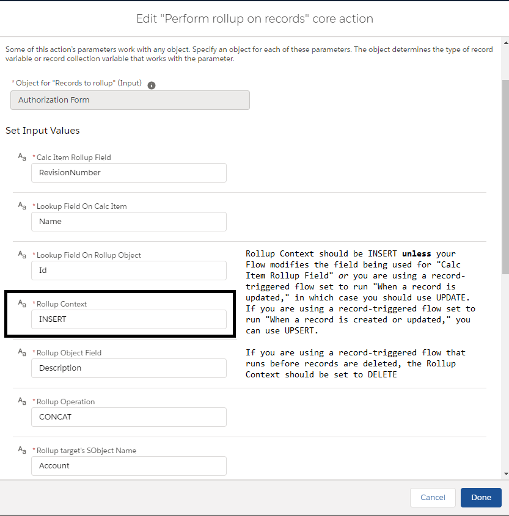

# Apex Rollup

[](https://github.com/jamessimone/apex-rollup/actions/workflows/deploy.yml 'Click to view deployment pipeline history')
[](https://codecov.io/gh/jamessimone/apex-rollup)
[](https://github.com/jamessimone/apex-rollup/blob/main/package.json)

## Getting Started

Create simple, fast, scalable custom rollups driven by Custom Metadata in your Salesforce org with Apex Rollup. Aggregate from any one object to another in an almost limitless amount of ways. Apex Rollup can not only mimic the standard Salesforce Master-Detail ROLLUP functionality (SUM, AVG, MIN, MAX) for Lookup relationships, Apex Rollup goes farther. Apex Rollup can count your related data, it can summarize your data by picking out the First or Last record based on conditions that you define. It can concatenate text together for you, and it can flag parent records if all, none, or some of that parent's children meet criteria. In addition, lookup relationships aren't a requirement for data aggregation: from being able to congregate the Contacts of an Account on an Opportunity to being able to being able to relate that one random Product SKU to any matching text on another record. Best of all? This functionality doesn't have to come from Apex! Apex Rollup works in Apex, Custom Metadata, Flows, and LWC.

Want to see examples of the magic? You can dive in depth on [Replacing DLRS With Custom Rollup](https://www.jamessimone.net/blog/joys-of-apex/replacing-dlrs-with-custom-rollup/) and on [Unofficial SF](https://unofficialsf.com/from-james-simone-create-powerful-rollups-in-your-flows-with-a-single-perform-rollup-action/). Looking to replace DLRS with Apex Rollup? We've even got that covered. [We have a whole migration section, just for you](#migrating-from-dlrs)!

Read below for more on how you can use Apex Rollup in your day-to-day. Please note that there are _toggleable_ dropdown sections used frequently in this document. Keep your eyes peeled for sections entitled "Expand for ...", as tapping on those will produce much more in the way of documentation. If visual learning is more your style, make sure to check out the YouTube setup walkthroughs:

## YouTube Video Tutorials

- [Setup & Full Recalc Walkthrough](https://youtu.be/QBb0r530ZV4)
- [Record Triggered Flow Setup](https://youtu.be/jZy4gUKjw3Q)
- [Apex Setup with one line of code!](https://youtu.be/RyQHXi5boW0)
- [Rollup Control custom metadata configuration](https://youtu.be/vUP_uBB2m-k)
- [Unit testing Apex Rollup](https://youtu.be/u7ly5xGMfFM)

As well, don't miss [the Wiki](../../wiki), which includes even more info for common topics like [setting up Task/Event/User rollups](../../wiki/Creating-Task-User-Event-Based-Rollups).

## Deployment & Setup

<a href="https://login.salesforce.com/packaging/installPackage.apexp?p0=04t6g000008OfezAAC">
  
</a>

<a href="https://test.salesforce.com/packaging/installPackage.apexp?p0=04t6g000008OfezAAC">
  
</a>
<br/>
<br/>

- For a namespaced version of Apex Rollup, [check the installation links here](./rollup-namespaced/README.md)
- Don't miss the [links to install the Rollup plugins!](#rollup-plugins).

_Before proceeding further_, Apex Rollup ships with a custom hierarchy setting, `Rollup Settings`, which you will have to create an Org Wide Default entry for by going to:

1. Setup
2. Custom Settings
3. Click `Manage` next to the `Rollup Settings` entry
4. Click `New` at the top to enter the Org Wide Defaults section - make sure `Is Enabled` is marked true and click `Save`

While you can still enable/disable individual rollups from running with the use of the `Rollup Control` CMDT (more details on that further on in the Readme), using a custom setting allows for several features that CMDT-based solutions currently lack:

- ease of installation/upgrade. Previously some users had issues when installing/upgrading due to pre-existing automation in their orgs interfering with the Apex Rollup tests
- granularity of control. Want to disable rollups from running for a specific user or profile? Easy as pie!

If you are writing your own Apex unit tests to validate that Apex Rollup is writing the values you expect for your rollups, please ensure you add the following snippet to your `@TestSetup` method:

```java
@TestSetup
static void setup() {
  upsert new RollupSettings__c(IsEnabled__c = true);
}
```

On the subject of unit testing rollups (which I highly recommend), since Apex Rollup runs asynchronously by default, you should also wrap the action(s) in your tests that you expect to call Apex Rollup in `Test.startTest();` and `Test.stopTest();`.

## Features

You have several different options when it comes to making use of Apex Rollup:

| Starting Point                                                         | Description                                                                         |
| ---------------------------------------------------------------------- | ----------------------------------------------------------------------------------- |
| [Custom Metadata-driven rollups](#cmdt-based-rollup-solution)          | Install with _one line of Apex code_                                                |
| [Flow-driven rollups](#flow--process-builder-invocable)                | There are several Readme & Wiki sections dedicated specifically to setting up Flows |
| [Full Recalculations](#calculating-rollups-after-install)              | Useful especially upon first install to prepopulate the existing rollup values      |
| [From the included LWC button](#using-the-parent-record-recalc-button) | Gets embedded on a parent record's flexipage. Grandparent rollups supported         |
| [Via Scheduled Job](#scheduled-jobs)                                   | Use Anonymous Apex or Scheduled Flow to setup                                       |

## CMDT-based Rollup Solution

Custom Metadata Type (CMDT) records are the preferred way to configure and organize your rollups. There are some limitations to this approach, particularly for popular objects like Task and Event - if you don't see the object you'd like to use in either the parent or child dropdown(s), use the "Text" version of that field (eg `Child Object (Text)`).

<details>
    <summary>Expand for CMDT-driven info</summary>
All you need is one line of code in any trigger where you'd like to perform rollups to a "parent" object. If you were taking values from your Opportunity records and rolling some of them up to the Account, this single line would be put into your `Opportunity.trigger` file or within your Opportunity Handler class:

```java
// in a trigger. after insert, after update, before delete, and after undelete are REQUIRED
// to be listed on your trigger in order for this to work properly
Rollup.runFromTrigger();
```

Let me repeat: you **must** have the following contexts listed on your trigger:

```java
trigger ExampleTrigger on Opportunity(after insert, after update, before delete, after delete, after undelete) {
  // after delete is required ONLY if your org does Account / Contact / Lead / Case merges
  Rollup.runFromTrigger();
  // etc. You can invoke the above from your handler if you have one
}
```

To be clear - the following trigger contexts are necessary when using `runFromTrigger` on any trigger installing Apex Rollup:

- after insert
- after update
- before delete
- after delete (**only necessary if your org does Account/Contact/Lead/Case merges** - repeated from the above comment). For more info please see [setting Rollup up to handle parent-level merges](#parent-level-merges) - note that the "Special Consideration" section needs to be expanded to properly scroll to the parent-level merge section.
- after undelete

This means that if you are invoking `Rollup.runFromTrigger();` from any other context (be it a quick action, LWC, Aura or wherever), nothing will happen; there won't be an error, but a rollup also won't be performed. For more information on one-off rollups, please see <a href="#calculating-rollups-after-install">Calculating Rollups After Install</a>.

The _only_ exception to the above is if you are using the `Is Rollup Started From Parent` checkbox field on the `Rollup__mdt` custom metadata (<a href="#rollup-custom-metadata-field-breakdown">more details on that below</a>). If the rollup starts from the parent, you are free to only list the trigger contexts that make sense for you - for example, if you are initiating a rollup from parent records and the children records whose values you are rolling up are only ever updated when the parent is being inserted, you are free to use `after insert` in your Apex trigger if you have no need of the other contexts.

That's it! Now you're ready to configure your rollups using Custom Metadata. Apex Rollup makes heavy use of Entity Definition & Field Definition metadata fields, which allows you to simply select your options from within picklists, or dropdowns. This is great for giving you quick feedback on which objects/fields are available without requiring you to know the API name for every SObject and their corresponding field names.

</details>

### Rollup Custom Metadata Field Breakdown

<details>
  <summary>Expand for Rollup CMDT field summary</summary>

Within the `Rollup__mdt` custom metadata type, add a new record with fields:

- `Child Object` - the SObject the calculation is derived from — in this case, Oppportunity
- `Parent Object` - the SObject you’d like to roll the values up to (in this case, Account)
- `Rollup Field On Child Object` - the field you’d like to aggregate (let's say Amount)
- `Lookup Field On Child Object`- the field storing the Id or String referencing a unique value on another object (In the example, Id)
- `Lookup Field On Parent Object` - the field on the parent object that matches the value stored in `Lookup Field On Child Object`
- `Rollup Field On Parent Object` - the field on the parent object where the rolled-up values will be stored (I've been using AnnualRevenue on the account as an example)
- `Rollup Operation` - A picklist field to select the operation you're looking to perform. Acceptable values are ALL / AVERAGE / CONCAT / CONCAT_DISTINCT / COUNT / COUNT_DISTINCT / FIRST / LAST / MAX / MIN / MOST / NONE / SOME / SUM
  - ALL / NONE / SOME operations can use the `Child Object Where Clause` to stipulate matching conditions. ALL is only true when all items match; SOME is true when at least one item matches; NONE is only true when there are children but none of them match. Please note that a parent with _no_ children items using a NONE clause will _not_ have a value. Checkbox, number, and text-based fields are acceptable parent targets for these operations, and will report true/false (for checkboxes and text) or 1/0, respectively.
  - Both CONCAT and CONCAT_DISTINCT separate values with commas by default in the rollup field itself, but you can use `Concat Delimiter` to change that
  - CONCAT / CONCAT_DISTINCT / FIRST / LAST / MOST operations support the usage of `Rollup Order By` Custom Metadata to stipulate how to sort records, or how to sort the concatenated values. For MOST, using `Rollup Order By` CMDT allows you to dictate how a tiebreaker for rollup values with the most instances can be handled (should a tie occur occur).
- `Rollup Control` - link to the Org Defaults for controlling rollups, or set a specific Rollup Control CMDT to be used with this rollup. Multiple rollups can be tied to one specific Control record, or simply use the Org Default record (included) for all of your rollups.
- `Rollup Grouping` (optional) - lookup field to `RollupGrouping__mdt`, a parent-level CMDT record used when rolling values from two different children objects up to the same parent field
- `Currency Field Mapping (Comma-separated)` (optional) - for organizations using Advanced Currency Management with Dated Exchange Rates, fill out this field if you are rolling up a currency field and you'd like to customize which field (or parent-level field) is used as the Date or Datetime to be matched with its corresponding Dated Exchange Rate. As an example, Opportunity Splits use `Opportunity,CloseDate` here by default - if you are using a parent-level field, the relationship name for it is the first value (thus, `Opportunity,CloseDate` is correct - `OpportunityId,CloseDate` would be incorrect).
- `Concat Delimiter` (optional) - for `CONCAT` and `CONCAT_DISTINCT` operations, the delimiter used between text defaults to a comma (unless you are rolling up to a multi-select picklist, in which case it defaults to a semi-colon), but you can override the default delimiter here. At this time, only single character delimiters are supported - please file [an issue](/issues) if you are looking to use multi-character delimiters!
- `Changed Fields On Child Object` (optional) - comma-separated list of field API Names to filter child records - only records where at least one of the fields listed has changed on an update will end up triggering a rollup. If you are using a `Child Object Where Clause`, I would not recommend using this field
- `Full Recalculation Default Number Value` (optional) - for some rollup operations (SUM / COUNT-based operations in particular), you may want to start fresh with each batch of calculation items provided. When this value is provided, it is used as the basis for rolling values up to the "parent" record (instead of whatever the pre-existing value for that field on the "parent" is, which is the default behavior).
  - It's valid to use this field to override the pre-existing value on the "parent" for number-based fields, _and_ that includes Date / Datetime / Time fields as well. In order to work properly for these three field types, however, the value must be converted into UTC milliseconds. You can do this easily using Anonymous Apex, or a site such as [Current Millis](https://currentmillis.com/).
  - Note that the default behavior for rollups that are number-based when there are no matching results is _null_, not `0` - you can put `0` in this field if you would prefer that for reporting purposes.
  - Does nothing when the rollup operation is `MOST`
- `Full Recalculation Default String Value` (optional) - same as `Full Recalculation Default Number Value`, but for String-based fields (including Lookup and Id fields).
- `Child Object Where Clause` (optional) - add conditions to filter the calculation items that are used. Nested conditionals (conditionals contained within parantheses) are supported. For best results, ensure you put spaces between each word, eg: `Amount != 5` works, `Amount!=5` will not work
  - Please [submit an issue](../../issues) if you are using Rollup and experience issues with calculation items correctly being flagged / not flagged toward the rollup field. For currency or number fields with multiple decimals, keep in mind that however the number appears in a SOQL query (ie `4.00`) is the format that you should use when performing filtering; `Amount > 4` will not match if a child record's value is stored as `4.000001`. The only exception to this is zero; there, you are allowed to omit the decimal places (eg `Amount > 4` will work regardless of if the value is 4, 4.00, 4.00000, etc...)
  - For more info, see [Special Considerations For Usage Of Child Object Where Clauses](#special-considerations-for-usage-of-child-object-where-clauses). Please note that the section [Rollup Custom Metadata Field Breakdown](#rollup-custom-metadata-field-breakdown) must be expanded in order for this link to work.
- `Group By Fields (Comma-separated)` (optional) - filling this field out turns any existing rollup into a group by rollup using the API names of children-level fields as supplied. For example, you could turn a SUM-based rollup on Opportunity into a grouping rollup, supplying fields like `StageName, Name` to sum the rollup field on Opportunity and group the output by Stage and Name. Can be used in conjunction with the next fields, `Group By Row (Start/End) Delimiter`. For multi-currency orgs where you are rolling up currency fields affected by multi-currency, please read the advanced notes in the Multi-Currency section.
- `Group By Row Start Delimiter` (optional) - if set, this is the delimiter which prefaces each row in the group by rollup to delimit results. Defaults to `•` if not supplied
- `Group By Row End Delimiter` (optional) - if set, this is the delimiter which is appended to each row in the group by rollup to delimit results. Defaults to a new line character if not supplied. Please also note that different new line characters are required depending on what type of field you're rolling up to - `<br>` will work for Rich Text fields, for example, while `\n` is the way to enter new lines for long text areas
- `Is Distinct` (optional, defaults to `false`) - de-duplicates the children item values for any parent prior to rolling them up
- `Is Full Record Set` (optional, defaults to `false`) - converts any rollup into a full recalculation (e.g. all _other_ child records associated with the parent(s) of the child records being passed in will be fetched and used in the rollup calculation)
- `Is Rollup Started From Parent` (optional, defaults to `false`) - if the the records being passed in are the parent records, check this field off. Apex Rollup will then go and retrieve the assorted children records before rolling the values up to the parents. If you are using `Is Rollup Started From Parent` and grandparent rollups with Tasks/Events (or anything with a polymorphic relationship field like `Who` or `What` on Task/Event; the `Parent` field on `Contact Point Address` is another example of such a field), you **must** also include a filter for `What.Type` or `Who.Type` in your `Child Object Where Clause` in order to proceed, e.g. `What.Type = 'Account'`.
- `Is Table Formatted` (optional, defaults to `false`) - set this to true _instead of_ using the `Group By Row Start Delimiter` and `Group By Row End Delimiter` if you are rolling up to a rich text field and you want the output to be a table.
- `Limit Amount` (optional) - should be used in conjunction with `Rollup Order By Custom Metadata`, otherwise the `Id` for each child object will be used as the implicit ordering. Allows rollup operations to enforce a limit on the number of matching calc items to use, to enable rollups like: "sum of the top five opportunities by amount".
- `Order By (First/Last)` (deprecated) - please see the the `Rollup Order By Custom Metadata` section below, as this field is deprecated as of [v1.4.0](<(https://github.com/jamessimone/apex-rollup/releases/tag/v1.4.0)>).
- `Grandparent Relationship Field Path` (optional) - if [you are rolling up to a grandparent (or greater) parent object](#grandparent-or-greater-rollups), use this field to establish the full relationship name of the field, eg from Opportunity Line Items directly to an Account's Annual Revenue: `Opportunity.Account.AnnualRevenue` would be used here. The field name (after the last period) should match up with what is being used in `Rollup Field On Parent Object`. For caveats and more information on how to setup rollups looking to use this functionality, please refer to the linked section.
- `One To Many Grandparent Fields` (optional, comma-separated text field) - used with Grandparent rollups when intermediate objects are actually junction (children) objects. When using this field, provide a comma-separated list that contains the junction object name and the field name that provides the lookup to the next record in your "grandparent" rollup. For example, if your starting object is an Account, and Contact is the junction object, your grandparent relationship field path could be `Contacts.Individual.Name` and your `One To Many Grandparent Fields` value would be `Contact.AccountId`. Two things to note: `Contacts` in the grandparent field path refers to the relationship name to the object named prior to the period in the One To Many Grandparent Fields, and the field API name is used after the period. You can perform multiple junction object "hops" by separating your values with commas: `Contact.AccountId, SomeOtherObject__c.SomeOtherField__c`
- `Rollup To Ultimate Parent` (optional) - Check this box if you are rolling up to an Account, for example, and use the `Parent Account ID` field on accounts, _and_ want the rolled up value to only be used on the top-level account. Can be used with any hierarchy lookup or lookup back to the same object. Must be used in conjunction with `Ultimate Parent Lookup` (below), and _can_ be used in conjunction with `Grandparent Relationship Field Path` (if the hierarchical field you are rolling up to is not on the immediate parent object).
- `Sharing Mode` (optional) - defaults to `System` (without sharing) but can be set to `User` to run with sharing criteria.
- `(Should) Run Without Custom Setting Flag?` - (optional) - If every configured Rollup has this flag set to true, it's not necessary to use the `RollupSetting__c.IsEnabled__c` flag on the included Custom Setting (useful for managed package implementations)
- `Split Concat Delimiter On Child Object?` (optional) - By default, CONCAT and CONCAT_DISTINCT operations will only apply the concat delimiter to the parent-level rollup field. Enable this field to also split the rollup item's values before concatenating to the parent.
- `Ultimate Parent Lookup` (optional) - specify the API Name of the field on the `Parent Object` using the dropdown that contains the hierarchy relationship. On Account, for example, this would be `Parent Account ID`. Must be filled out if `Rollup To Ultimate Parent` is checked.
- `Description` (optional) - note-taking field in the event you'd like to provide additional info to other admins/users about your configured rollup

You can have as many rollups as you'd like per object/trigger — all operations are boxcarred together for optimal efficiency.

It is possible to have do SUM/COUNT-based rollups from different children types to the same parent field because these rollup operations utilize diff-based calculations by default. If you are looking to roll up values using other rollup operation types to the same parent field from different children, you may be able to do so with additional setup.

#### Special Considerations For Usage Of Child Object Where Clauses

In addition to the above, some other considerations when it comes to the where clause:

- Any time a polymorphic field is used in your `Child Object Where Clause`, you must also have a constraint on the parent-level `Type` in order for it to work. If you are filtering on `Task.What`, for example, you must have only a single SObject-parent type as part of your where clause, e.g. `What.Name = 'someName' AND What.Type = 'Account'`.
- for rollups set up against objects with Large Data Volume (LDV - typically when the number of records for a given object exceed 300k), please note that full recalculations (either through the `REFRESH` context in Flow or through the `Recalculate Rollups` tab) are subject to the same query limits that exist elsewhere with SOQL; namely, that filtering on non-indexed fields can cause the initial batch recalculation process to timeout. If you receive an error with the message `REQUEST_RUNNING_TOO_LONG`, it's likely you're trying to roll values up using a where clause with non-indexed fields. Try changing your where clause to use indexed fields, or contact Salesforce Support to have a custom index created (as of Winter '23, you can also create custom indexes programmatically through the CLI, but I would only recommend this option to advanced users)

</details>

### Configure Custom Orderings With Rollup Order By Metadata

<details>
  <summary>Expand for Rollup Order By CMDT info</summary>

Use these records to set up rules for how the records associated with your rollup will be ordered. If a `FIRST` or `LAST` rollup is defined _without_ one of these records, the `Rollup Field On Child Object` is used to order things; similarly, a limit-based rollup (configured with the `Limit Amount` field on Rollup CMDT and Flow, or with the `addLimit` method with imperative Apex) will use the `Id` field for each child object if no other ordering is supplied.

- `Ranking` - number value defining the order priority for any given `Rollup Order By` CMDT record. It's fine to start with 0 or with 1; ranking must be unique amongst all the records you create here
- `Field Name` - the API name for the field to order by
- `Sort Order` (optional) - Default order is ascending
- `Null Sort Order` (optional) - By default, nulls are sorted first

**Special note** - for `CONCAT`-based rollups whose parent field is a picklist (including multi-select picklists), the _default sort_ in the absence of Rollup Order By CMDT uses the "ranking" for that picklist. However, if you define Rollup Order By CMDT children for a rollup like this, _only_ the custom sorting logic you've defined using Rollup Order By will be run.

</details>

### Configure Rollup Settings with Control Metadata

<details>
  <summary>Expand for Rollup Control CMDT info</summary>

Rollup Control CMDT (`RollupControl__mdt`) is used to establish limits on Rollup operations, and can be setup in several different ways:

- if you're using the CMDT trigger-based approach highlighted above to manage your rollups, you can tie the `Rollup Control` record to an individual `Rollup__mdt` record
- if you're using an invocable/scheduled/custom Apex-based approach, you can use specific patterns to match on the rollup being performed - see `Trigger Or Invocable Name` below
- you can use the included Rollup Control with API Name `Org_Defaults` to specify master-level overrides for all your rollups.

**Special note on the Org Default rollup control record** - whenever you upgrade the version of Apex Rollup you're using, any values you've customized on the Org Default will be overwritten. If you aren't customizing the values, or if updating the values back doesn't bother you, this won't be an issue. Otherwise, it can be helpful to use the Org Default record as a _starting point_ for your own Rollup Control record(s) so that the control record(s) you end up using don't get updated when you update Apex Rollup.

These are the fields on the `Rollup Control` custom metadata type:

- `Batch Chunk Size` - (defaults to 2000) - The amount of records passed into each batchable job in the event that Rollup batches. Default is 2000, which is the vanilla Salesforce default for batch jobs.
- `Is Dev Ed Or Trial Org` - (defaults to false) - Salesforce limits how many times Queueable jobs can be enchained in these orgs specifically. Update this value to true if you are working in a Developer Edition or Trial Org with large data volume, as testing in these orgs can otherwise hit the maximum stack depth allowed for Queueables.
- `Is Merge Reparenting Enabled` - (defaults to true) - By default, if there is an `after delete` trigger context for Account / Case / Contact / Lead where Rollup is being used and one or more of those records is merged, Rollup goes and updates any children records from the old lookup to the new lookup automatically prior to recalculating rollup values. If you have pre-existing merge handling covered in your org by some other means, you should disable this checkbox and ensure that Rollup is only called _after_ your pre-existing merge handling has run.
- `Is Rollup Logging Enabled` - (defaults to false) - Check this box in order to debug your rollups. Debug information is included in a few mission-critical pieces of Rollup to provide you with more information about where exactly an error might be occurring, should you encounter one. For more information, see the [Rollup Plugins](#rollup-plugins) section
- `Max Lookup Rows Before Batching` - if you are rolling up to an object that interacts in many different ways within the system, Apex Rollup moves from using a Queueable based system (read: fast and light) to a Batched Apex approach (read: solid, sometimes slow). You can override the default for switching to Batch Apex by lowering the number of rows. Without an `Org_Default` record, this defaults to `3333`
- `Max Number Of Queries` - (defaults to 50) - Configure this number to decide how many queries Rollup is allowed to issue before restarting in another context. Consider the downstream query needs when your parent objects are updated when configuring this field. By safely requeueing Rollup in conjunction with this number, we ensure no query limit is ever hit.
- `Max Query Rows` - (defaults to 25,000) - the max number of rows that can be queried by Apex Rollup in a single transaction. Otherwise, the rollup will be deferred and will continue running in another asynchronous context.
- `Max Parent Rows Updated At Once` (defaults to 5000) - The maximum number of parent rows that can be updated in a single transaction. Otherwise, Rollup splits the parent items evenly and updates them in separate transactions. If you don't fill out this field (on the Org Defaults or specific Control records), defaults to half of the DML row limit.
- `Max Rollup Retries` - (defaults to 100) - Only configurable on the Org Default record. Use in conjunction with `Max Query Rows`. This determines the maximum possible rollup jobs (either batched or queued) that can be spawned from a single overall rollup operation due to the prior one(s) exceeding the configured query limit.
- `Flow - Only Run In These Contexts` - Provide a comma-separated list of flow contexts (INSERT, UPDATE, UPSERT, DELETE, REFRESH) that flow-powered rollups should run in (skips any rollups called where the flow context does not match an entry in this list)
- `Replace Calc Items Async When Over Count` - (defaults to 1) - in some instances, calc items passed into rollup need to be requeried - either to get additional fields (in the case of polymorphic queries), or if parent-level filters have been added to any rollup's `Child Object Where Clause`. For these cases, we want to avoid adding unncessary queries to the sync portion of the run; we also want to avoid a slowdown in the sync processing time that Apex Rollup requires. You can change this number from the default of 1 to 0 if you want any necessary replacement to _always_ happen in the async scope.
- Apex Rollup (optional) - lookup field to the `Rollup__mdt` metadata record.
- `Should Abort Run` - if done at the `Org_Defaults` level, completely shuts down all rollup operations in the org. Otherwise, can be used on an individual rollup basis to turn on/off.
- `Should Duplicate Rules Be Ignored` (defaults to false) - By default, duplicate rules are enforced on rollup updates. Set this to true to bypass duplicate rules for rollups.
- `Should Run As` - a picklist dictating the preferred method for running rollup operations. Possible values are `Queueable`, `Batchable`, or `Synchronous Rollup`. By default, Apex Rollup runs asynchronously as a queueable. Only one queueable can be fired from a process that's already asynchronous, and while Apex Rollup automatically detects such things, if _another_ bit of code that runs _after_ Apex Rollup needs to use that Queueable, `Batchable` may be a better option. When set to `Synchronous Rollup`, all calculations occur prior to an insert / update / delete being finished on the children records.
- `Should Run Single Records Synchronously` - Apex Rollup typically uses the `Should Run As` picklist to determine the default execution context for rollups (which tends to be async). This checkbox deviates from that methodology by forcing single record updates to run sync (whenever possible), which helps with handling updates from datatables or other features using Lightning Data Service (LDS).
- `Should Skip Resetting Parent Fields` (defaults to false) - for full recalculations and REFRESH-based child item updates, Apex Rollup by default assumes that for a parent record with no matching children, the parent-level field should be reset. If this checkbox is set to true, those parent records without results will simply be ignored, and will not be updated.
- `Should Throw On Save Errors` (defaults to false) - by default, Apex Rollup does not throw when a parent-level update fails due to something like validation rules failing or errors being thrown from Flow/Apex. Set this to true if you'd like to bubble up save exceptions.
- `Trigger Or Invocable Name` - If you are using custom Apex, a schedulable, or rolling up by way of the Invocable action and can't use the Apex Rollup lookup field. Use the pattern `trigger_fieldOnCalcItem_to_rollupFieldOnTarget_rollup` - for example: 'trigger_opportunity_stagename_to_account_name_rollup' (use lowercase on the field names). If there is a matching Rollup Limit record, those rules will be used. The first part of the string comes from how a rollup has been invoked - either by `trigger`, `invocable`, or `schedule`. A scheduled flow still uses `invocable`!

</details>

## Flow / Process Builder Invocable

Invoking the Apex Rollup process from a Flow is simple, and for most use-cases is the easiest way for admins to get started. If, however, you are using Account, Case, Contact or Lead as the parent for a rollup operation and merges on those objects are supported in your org, the best practice is instead going to be using the Apex trigger one-liner to implement Apex Rollup. Expand the [Special Considerations](#special-considerations) section and then navigate to [Parent Level Merges](#parent-level-merges) for more info.

This is also the preferred method for scheduling; while I do expose the option to schedule a rollup from Apex, I find the ease of use in creating Scheduled Flows in conjunction with the deep power of properly configured Invocables to be much more scalable than the "Scheduled Jobs" of old. This also gives you the chance to do some truly crazy rollups — be it from a Scheduled Flow, an Autolaunched Flow, or a Platform Event-Triggered Flow.

### Considerations For Scheduled Flows

In order to prevent blowing through the Flow Interview limit for each day, it's important to note that the use of Apex Rollup with a specific SObject in the scheduled flow's start node will run a flow interview for _every_ record retrieved. However, if the scheduled flow is run without a specific SObject having been selected in the start node, the process is bulkified successfully and you only consume a single flow interview per batch of records.

### Perform Rollup on records Invocable Action

<details>
  <summary>Expand for base invocable action info</summary>


[Check out the Wiki article for more info on this action](../../wiki/Perform-Rollup-On-Records---Base-Invocable-Action), or follow along below -

Here are the arguments necessary to invoke Apex Rollup from a Flow / Process Builder using the `Perform Rollup on records` action:

- `Object for "Records To rollup" (input)` - comes from your calculation items, and their SObject type should be selected accordingly. If you are rolling up from Opportunity to Account, you would select Opportunity as the type
- `Object for "Prior records To rollup" (input)` - should be the same as the above
- `Child Object Calc Field` - the API Name of the field you’d like to aggregate (let's say Amount)
- `Child Object Lookup Field`- the API Name of the field storing the Id or String referencing a unique value on another object (In the example, Id)
- `Rollup Object API Name` - the API name for the object that the child object values will be rolled up to
- `Rollup Object Lookup Field` - the API Name of the field on the parent object that matches the value stored in `Lookup Field On Child Object`
- `Rollup Object Calc Field` - the API Name of the field on the parent object where the rolled-up values will be stored (I've been using AnnualRevenue on the account as an example)
- `Rollup Operation` - the operation you're looking to perform. Acceptable values are ALL / AVERAGE / CONCAT / CONCAT_DISTINCT / COUNT / COUNT_DISTINCT / FIRST / LAST / MAX / MIN / MOST / NONE / SOME / SUM. Both CONCAT and CONCAT_DISTINCT separate values with commas by default, but you can use `Concat Delimiter` to change that. For more info see the "Rollup Operation" section within the "Rollup Custom Metadata Field Breakdown" overview.
- `Rollup Operation Context` - INSERT / UPDATE / UPSERT / DELETE / REFRESH. **Special note** - unless you are using a Record-Triggered Flow / After Update Process Builder, you almost assuredly want to simply use the INSERT context (see image below). However, you _would_ use something like UPDATE if, after retrieving records using Get Records in an auto-launched flow, you then looped through your collection and modified fields prior to sending them to Apex Rollup. You would only ever use UPSERT for a record-triggered flow triggering on `A record is created or updated`. REFRESH does a full recalc operation even if the rollup operation being used is not typically a full recalc.
- `Records To Rollup` - a collection of SObjects. These need to be stored in a collection variable. **Note** - while this is an optional property, that is only because of a bug in the Flow engine caused by `Get Records` returning null when you use filter conditions that in turn make it so that no records are returned - which then throws an error when using this action without explicitly checking the collection returned by `Get Records` to see if it is null. Because that's a lot to ask of the Flow user, we instead let the collection be optional and handle the null check in Apex. You should **always** provide a value for this input!
- `Prior records to rollup` (optional) - another collection of SObjects. For record-triggered flows set to run when `A record is created or updated`, or `A record is updated`, it's necessary to populate this argument - otherwise, Rollup will helpfully throw an error when you attempt to update records. Add `{!$Record__Prior}` to a collection variable and use that collection to populate this argument
- `Child Object Changed fields` (optional) - comma-separated list of field API Names to filter child records from being used in the rollup calculations unless any of the stipulated fields have changed
- `Child Object Type When Rollup Started From Parent` (optional) - only necessary to provide if `Is Rollup Started From Parent` field is enabled and set to `{!$GlobalConstant.True}` _or_ if you are using the base Rollup invocable action to detect reparenting for an intermediate parent in a grandparent rollup. Normally in this invocable, the child object type is figured out by examining the passed-in collection - but when the collection is the parent records, we need the SObject API name of the children items to be explicitly defined.
- `Concat Delimiter` (optional) - for `CONCAT` and `CONCAT_DISTINCT` operations, the delimiter used between text defaults to a comma (unless you are rolling up to a multi-select picklist, in which case it defaults to a semi-colon), but you can override the default delimiter here.
- `Concat Delimiter Split Should Apply On Child Object` (optional) - for `CONCAT` and `CONCAT_DISTINCT` operations, the text values on the Child Object's field being rolled up can _also_ be split if this field is enabled and set to `{!$GlobalConstant.True}`
- `Currency Field Mapping (Comma-separated)` (optional) - for organizations using Advanced Currency Management with Dated Exchange Rates, fill out this field if you are rolling up a currency field and you'd like to customize which field (or parent-level field) is used as the Date or Datetime to be matched with its corresponding Dated Exchange Rate. As an example, Opportunity Splits use `Opportunity,CloseDate` here by default - if you are using a parent-level field, the relationship name for it is the first value (thus, `Opportunity,CloseDate` is correct - `OpportunityId,CloseDate` would be incorrect).
- `Defer Processing` (optional, default `false`) - when checked and set to `{!$GlobalConstant.True}`, you have to call the separate invocable method `Process Deferred Rollups` at the end of your flow. Otherwise, each invocable action kicks off a separate queueable/batch job. **Note** - for extremely large flows calling dozens of rollup operations, it behooves the end user / admin to occasionally call the `Process Deferred Rollups` invocable action to separate rollup operations into different jobs. You'll avoid running out of memory by doing so. See the "Process Deferred Rollups" section below for more info.
- `Full Recalculation Default Number Value` (optional) - for some rollup operations (SUM / COUNT-based operations in particular), you may want to start fresh with each batch of calculation items provided. When this value is provided, it is used as the basis for rolling values up to the "parent" record (instead of whatever the pre-existing value for that field on the "parent" is, which is the default behavior). **NB**: it's valid to use this field to override the pre-existing value on the "parent" for number-based fields, _and_ that includes Date / Datetime / Time fields as well. In order to work properly for these three field types, however, the value must be converted into UTC milliseconds. You can do this easily using Anonymous Apex, or a site such as [Current Millis](https://currentmillis.com/). Does nothing when the rollup operation is `MOST`.
- `Full Recalculation Default String Value` (optional) - same as `Full Recalculation Default Number Value`, but for String-based fields (including Lookup and Id fields).
- `Grandparent Relationship Field Path` (optional) - if [you are rolling up to a grandparent (or greater) parent object](#grandparent-or-greater-rollups), use this field to establish the full relationship name of the field, eg from Opportunity Line Items directly to an Account's Annual Revenue: `Opportunity.Account.AnnualRevenue` would be used here. The field name should match up with what is being used in `Rollup Field On Parent Object`. Please see the caveats in the linked section for more information on how to set up your rollups correctly when using this feature.
- `Group By Fields (Comma-separated)` (optional) - filling this field out turns any existing rollup into a group by rollup using the API names of children-level fields as supplied. For example, you could turn a SUM-based rollup on Opportunity into a grouping rollup, supplying fields like `StageName, Name` to sum the rollup field on Opportunity and group the output by Stage and Name. Can be used in conjunction with the next fields, `Group By Row (Start/End) Delimiter`. For multi-currency orgs where you are rolling up currency fields affected by multi-currency, please read the advanced notes in the Multi-Currency section.
- `Group By Row Start Delimiter` (optional) - if set, this is the delimiter which prefaces each row in the group by rollup to delimit results. Defaults to `-` if not supplied
- `Group By Row End Delimiter` (optional) - if set, this is the delimiter which is appended to each row in the group by rollup to delimit results. Defaults to a new line character if not supplied. Please also note that different new line characters are required depending on what type of field you're rolling up to - `<br>` will work for Rich Text fields, for example, while `\n` is the way to enter new lines for long text areas
- `One To Many Grandparent Fields` (optional, Comma separated list) - see [Rollup Custom Metadata Field Breakdown](#rollup-custom-metadata-field-breakdown) for more info, used in conjunction with `Grandparent Relationship Field Path`
- `Is Distinct` (optional, defaults to `false`) - de-duplicates the children item values for any parent prior to rolling them up
- `Is Full Record Set` (optional) - converts any rollup into a full recalculation (e.g. all _other_ child records associated with the parent(s) of the child records being passed in will be fetched and used in the rollup calculation)
- `Is Rollup Started From Parent` (optional, defaults to `{!$GlobalConstant.False}`) - set to `{!$GlobalConstant.True}` if collection being passed in is the parent SObject, and you want to recalculate the defined rollup operation for the passed in parent records. Used in conjunction with `Child Object Type When Rollup Started From Parent`. If you are using `Is Rollup Started From Parent` and grandparent rollups with Tasks/Events (or anything with a polymorphic relationship field like `Who` or `What` on Task/Event; the `Parent` field on `Contact Point Address` is another example of such a field), you **must** also include a filter for `What.Type` or `Who.Type` in your `Child Object Where Clause` in order to proceed, e.g. `What.Type = 'Account'`.
- `Is Table Formatted` (optional, defaults to `false`) - set this to true _instead of_ using the `Group By Row Start Delimiter` and `Group By Row End Delimiter` if you are rolling up to a rich text field and you want the output to be a table.
- `Limit Amount` (optional) - can be used in conjunction with `Order By (First/Last)` below, otherwise the `Id` for each child object will be used as the implicit ordering. Allows rollup operations to enforce a limit on the number of matching calc items to use, to enable rollups like: "sum of the top five opportunities by amount".
- `Order By (First/Last)` (optional) - only valid when FIRST/LAST/MOST is used as the Rollup Operation (alternatively, if a `Limit Amount` is stipulated). Accepts a comma-separated list associated with the fields you'd like to order by, including the sort order and null sort order. For example: `Name nulls last, Industry` would use the Name field on a record with nulls last, followed by a sort on the Industry field to do tie-breakers. This field is optional on a first/last/most operation, and if a field is not supplied, the `Rollup Field On Child Object` is used.
- `Parent Record Id for Empty Children Collections` (optional) - Runs rollup calculations even if no matching children when passed. Must also fill out `Child Object Type When Rollup Started From Parent` property as well.
- `Sharing Mode` (optional) - defaults to `System` (without sharing) but can be set to `User` to run with sharing criteria.
- `Should rollup to ultimate hierarchy parent` (optional) - Check this box if you are rolling up to an Account, for example, and use the `Parent Account ID` field on accounts, _and_ want the rolled up value to only be used on the top-level account. Can be used with any hierarchy lookup or lookup back to the same object. Must be used in conjunction with `Ultimate Parent Lookup` (below), and _can_ be used in conjunction with `Grandparent Relationship Field Path` (if the hierarchical field you are rolling up to is not on the immediate parent object).
- `Should run sync` (optional) - Check this box if you'd like the parent items to be updated in a synchronous context. Note that if `Defer Processing` is set to true, the synchronous bit will only come into play whenever the `Process Deferred Rollup` action is called.
- `SOQL Where Clause To Exclude Calc Items` (optional) - add conditions to filter the calculation items that are used. **Note** - the fields, especially parent-level fields, _must_ be present on the calculation items or the filtering will not work correctly. For currency or number fields with multiple decimals, keep in mind that however the number appears in a SOQL query (ie `4.00`) is the format that you should use when performing filtering; `Amount != 4` will not work if the value is stored as `4.00`. The only exception to this is zero; there, you are allowed to omit the decimal places. For more, see [Special Considerations For Usage Of Child Object Where Clauses](#special-considerations-for-usage-of-child-object-where-clauses) - please note that the section [Rollup Custom Metadata Field Breakdown](#rollup-custom-metadata-field-breakdown) must be expanded in order for this link to work
- `Ultimate Parent Field` (optional) - specify the API Name of the field on the `Parent Object` that contains the hierarchy relationship. On Account, for example, this would be `ParentId`. **Must** be filled out if `Rollup To Ultimate Parent` is checked.

Here is an example of the base action filled out (not shown, but also important - the assignment of the collection to the `Records to rollup` variable):



</details>

### Perform Rollup\_\_mdt-based rollup Invocable Action

<details>
  <summary>Expand for CMDT-driven invocable action info</summary>

[Check out the Wiki article for more info on this action](../../wiki/Perform-Rollup__mdt-based-rollup-Invocable), or follow along below -

This action functions similarly to how the `Rollup.runFromTrigger()` method does within Apex - you stipulate a calculation object, pass in the records associated with that object, and all Rollups configured via the CMDT `Rollup__mdt` are performed. **Note** - there are additional optional fields that match exactly the optional fields defined in the [base invocable action](#perform-rollup-on-records-invocable-action) (above) that you can use to override your CMDT values for a specific flow. Only include these values if you want to override your CMDT values!

Here are the fields for this invocable:

- `Rollup Context` - INSERT / UPDATE / UPSERT / DELETE / REFRESH. **Special note** - unless you are using a Record-Triggered Flow / After Update Process Builder, you almost assuredly want to simply use the INSERT context. However, you _would_ use something like UPDATE if, after retrieving records using Get Records in an auto-launched flow, you then looped through your collection and modified fields prior to sending them to Apex Rollup. You would only ever use UPSERT for a record-triggered flow triggering on `A record is created or updated`. REFRESH does a full recalc operation even if the rollup operation being used is not typically a full recalc.
- `Defer Processing` (optional, default `true`) - true by default, otherwise when checked it must be set to `{!$GlobalConstant.False}` in order to immediately kick off rolling up. Otherwise, you have to call the separate invocable method `Process Deferred Rollups` at the end of your flow. Otherwise, each invocable action kicks off a separate queueable/batch job. **Note** - for extremely large flows calling dozens of rollup operations, it behooves the end user / admin to occasionally call the `Process Deferred Rollups` to separate rollup operations into different jobs. You'll avoid running out of memory by doing so. See "Process Deferred Rollups" (below) for more info.
- `Records To Rollup` - a collection of SObjects. These need to be stored in a collection variable. Like the `Perform rollup on records` invocable, this collection is not marked as required to get around a weird bug in the Flow engine with required fields and `Get Records`. If the collection you are passing in comes not from a record-triggered Flow, but from `Get Records`, this prevents you from having to check explicitly in Flow if the collection is null or not. You should **always** provide this input!
- `Prior records to rollup` (optional) - another collection of SObjects. For record-triggered flows set to run when `A record is created or updated`, or `A record is updated`, it's necessary to populate this argument - otherwise, Rollup will helpfully throw an error when you attempt to update records. Add `{!$Record__Prior}` to a collection variable and use that collection to populate this argument
- `Child Object Type When Rollup Started From Parent` (optional) - only necessary to provide if `Is Rollup Started From Parent` is enabled on your CMDT record. Normally in this invocable, the child object type is figured out by examining the passed-in collection - but when the collection is the parent records, we need the SObject name of the calculation items explicitly defined.
- `Sharing Mode` (optional) - defaults to `System` (without sharing) but can be set to `User` to run with sharing criteria.
- `Should run sync` (optional) - Check this box if you'd like the parent items to be updated in a synchronous context. Note that if `Defer Processing` is set to true, the synchronous bit will only come into play whenever the `Process Deferred Rollup` action is called.

</details>

### Process Deferred Rollups Invocable

Used in conjunction with the `Perform rollup on records` or `Perform Rollup__mdt-based rollup` invocables above when the `Defer Processing` input is set to `{!$GlobalConstant.True}` (the default on the CMDT invocable, opt-in for the vanilla `Perform rollup on records` action). Kicks off the actual rollup process when there are rollups with deferred processing.

### Full Recalc CMDT-driven Invocable

Run full recalculation rollups directly from flow by passing in a comma-separated input variable with the API names of `Rollup__mdt` records. Functionality contributed by [@dschibster](https://github.com/dschibster)!

## Calculating Rollups After Install

Use the included app and permission set (`See Rollup App`) permission set to uncover the Apex Rollup app - a single-page-application where you can manually kick off rollup jobs. This is important because Apex Rollup works on an ongoing basis; in order for your rollups to be correct, unless the child object you're starting to rollup has no rows when you implement Apex Rollup, a one-off full recalculation is necessary. Here's how you would fill out the page to get things started:


You can also kick off full recalculations by using your already-configured `Rollup__mdt` CMDT records:


In either case, if you fill out the form values _or_ start the full recalculation via your selected CMDT records, the screen will lock until the rollup recalculation has finished. There's a small piece of text at the bottom with information about what the recalculation job's status is, and the screen will only unlock after it has either finished, failed, or been manually aborted by you.

## Using The Parent Record Recalc Button

There is an included Lightning Web Component (LWC) that will show up in the "Custom" section of the Lightning App Builder under the heading `Recalc Rollups Button`. As promised, you can drop this button anywhere on a parent SObject's record flexipage to enable users to recalculate the rollups just for that parent on the fly:


**Special notes on the recalc button**

- It relies on your rollups being configured using the `Rollup__mdt` CMDT. Unfortunately this means that it won't work for Rollups that are configured via the base Invocable Action
- The button will not display on the flexipage at all until at least one `Rollup__mdt.LookupObject__c` field matches the SObject whose record flexipage you're dropping the button on
- The button _will_ display even if a given parent record has no matching children associated with the rollup(s) in question.
- This particular rollup runs synchronously, so it won't eat into your Asynchronous Job limits for the day; it also refreshes any Aura/page-layout sections of the page (LWC-based sections of the page should update automatically).
- Editing `Rollup__mdt` records with a parent record's page open can lead to unexpected behavior. This is because the `Rollup__mdt` records are cached on page load, so any updates made to those records will require a page refresh prior to clicking the `Recalc Rollup` button
- Triggering recalcs from a grandparent record is supported, but polymorphic grandparents (for example, an Account rollup that starts from Task -> Opportunity -> Account through the `WhatId` is not yet supported).

## Scheduled Jobs

I would _highly_ recommend [scheduling through Scheduled Flows](#considerations-for-scheduled-flows).

That being said, Apex Rollup exposes the option to use Scheduled Jobs if that's more your style. You can use the following Anonymous Apex script to schedule rollups:

```java
// Method signature: (String jobName, String cronExp, String query, String rollupObjectName, Evaluator eval)
Rollup.schedule(
  'My example job name',
  'my cron expression, like 0 0 0 * * ?',
  'my SOQL query, like SELECT Id, Amount FROM Opportunity WHERE CreatedDate > YESTERDAY',
  'The API name of the Child SObject associated with Rollup__mdt records for this schedule',
  null
);
```

That last argument - the `null` value - has to implement an interface called `Evaluator` (or it can just be left null). More on that below.

Note that the third argument - the `String rollupObjectName` should be one of two values:

- the API name of the object(s) where rollups are started from the parent (where `Is Rollup Started From Parent` on `Rollup__mdt` is checked off) OR
- the API name of the object(s) where rollups are started from the child object

In either case, the SOQL query needs to correspond to either the parent or the children records that you'd like to operate on.

## Grandparent (Or Greater) Rollups

<details>
  <summary>Expand for Grandparent rollup info</summary>

[Check out the Wiki article for more information on Grandparent rollups](<../../wiki/Configuring-Grandparent-(or-Greater)-Rollups>), the [Wiki article for Ultimate Parent Rollups](../../wiki/Configuring-Hierarchy-Ultimate-Parent-Rollups) or follow along here -

It's not all that uncommon, especially with custom objects, to get into the practice of rolling up values from one object merely so that _another_ parent object can receive _those_ rolled up values; that is to say, we occasionally use intermediate objects in order to roll values up from a grandchild record to a grandparent (and there's no need to stop there; it's totally possible to want to roll up values from great-grandchildren to the great-grandparent record, and so on). Apex Rollup offers the never-before-seen functionality of skipping the intermediate records so that you can go directly to the ultimate parent object. This is supported through the invocable rollup actions, as well as through the CMDT-based rollup approach by filling out the optional field `Grandparent Relationship Field Path`:


In this example, there are four objects in scope:

- `ApplicationLog__c`, which has a lookup field `Application__c`
- `Application__c`, which has a lookup field `ParentApplication__c`
- `ParentApplication__c`, which has a lookup field `Account__c`
- `Account`, and the field we'd like to rollup to has the API name `AnnualRevenue`

**Important things to note about grand(or greater)parent rollups:**

- **super important** all intermediate objects in the chain (so, in this example, `Application__c`, and `ParentApplication__c`) must _also_ have the `Rollup.runFromTrigger()` snippet in those object's triggers (or the appropriate invocable built). This special caveat handles cases where the intermediate objects' lookup fields are updated; no big deal if the ultimate parent lookup hasn't changed, but _big_ deal if the ultimate parent lookup _has_ changed
- if your CMDT/invocable is set up with a relationship that is not the immediate parent and you don't fill out the `Grandparent Relationship Field Path`, it simply won't work. The field path is required because it's common for objects to have more than one lookup field to the same object
- if you are using `Grandparent Relationship Field Path` with a polymorphic standard field like `Task.WhatId` or `Task.WhoId`, you should also supply a `Child Object Where Clause` to ensure you are filtering the calculation items to only be related to one type of parent at a time (eg: your `Child Object Where Clause` would look like `What.Type = 'Account'`)
- grandparent rollups respect [SOQL's map relationship-field hopping of 5 levels](https://developer.salesforce.com/docs/atlas.en-us.soql_sosl.meta/soql_sosl/sforce_api_calls_soql_relationships_query_limits.htm):

> In each specified relationship, no more than five levels can be specified in a child-to-parent relationship. For example, `Contact.Account.Owner.FirstName` would be three levels.

While the base architecture for retrieving grand(or greater)parent items has no technical limit on the number of relationship field hops that can be made, correctly re-triggering the rollup calculations after an intermediate object has been updated made it necessary to respect this limit (for now).

</details>

## Custom Apex Rollups

<details>
  <summary>Click for all Apex info</summary>

If the CMDT-based or other solutions won't cut it and you need more customizability, there's an extensive API surface exposed by Apex Rollup using global static helper methods:

```java
// you can batch rollup operations into one!
Rollup.batch(
  Rollup.countDistinctFromApex(Opportunity.Amount, Opportunity.AccountId, Account.Id, Account.NumberOfEmployees, Account.SObjectType),
  Rollup.sumFromApex(Opportunity.Amount, Opportunity.AccountId, Account.Id, Account.AnnualRevenue, Account.SObjectType)
);
```

**Note** - the invocable-based Apex methods are not documented here. I have only changed an invocable method's signature twice in the history of this project, but because it _has_ happened, it probably will happen again. Otherwise, the APIs represented here are stable; I can't promise the same of the Invocable methods, but you are free to use them so long as you keep in mind that you may need to update any methods calling the static Invocable methods (outside of Flow/PB) if they are referenced within your Apex code.

The following methods are exposed:

```java
// in Rollup.cls

// instance methods
global Rollup runCalc() // more on this method below
// see RollupIntegrationTests for examples of how to use addLimit with imperative Apex
global Rollup addLimit(Integer limitAmount, Schema.SObjectField rollupFieldOnCalcItem)
// imperative Apex can add RollupOrderBy__mdt records to any rollup operation (matching by the "calcItemRollupField")
// for use in conjunction with "addLimit" above
global Rollup addOrderBys(List<RollupOrderBy__mdt> orderBys, Schema.SObjectField calcItemRollupField)
// use this to do things like turn a regular rollup into a GROUP BY rollup
global Rollup modifyMetadata(Rollup__mdt template)

// static methods
global static void batch(Rollup rollup, Rollup secondRollup)
global static void batch(Rollup rollup, Rollup secondRollup, Rollup thirdRollup)
global static void batch(List<Rollup> rollups)


// for using as the "one line of code" and CMDT-driven rollups
global static void runFromTrigger()

// the alternative one-liner for CDC triggers
// more on that in the CDC section of "Special Considerations", below
global static void runFromCDCTrigger()

// imperatively from Apex, relying on CMDT for additional rollup info
// if you are actually using this from WITHIN a trigger, the second argument should
// ALWAYS be the "Trigger.operationType" static variable (unless you're unit testing)
global static void runFromApex(List<SObject> children, TriggerOperation rollupContext)

// overload of the above, with support for the Trigger.oldMap variable (or your unit-tested approximation thereof)
global static void runFromApex(List<SObject> children, Map<Id, SObject> oldChildrenMap, TriggerOperation rollupContext)

// for more info on how this method differs from the one above it, check out the "Parent Level Merges" section!
// for anything OTHER than merge situations use of this method is an anti-pattern
global static Rollup runFromApex(List<Rollup__mdt> rollupMetadata, Evaluator eval, List<SObject> children, Map<Id, SObject> oldChildrenMap)

// imperatively from Apex with arguments taking the place of values previously supplied by CMDT
// can be used in conjunction with "batch" to group rollup operations (as seen in the example preceding this section)
global static Rollup averageFromApex(
  SObjectField averageFieldOnCalcItem,
  SObjectField lookupFieldOnCalcItem,
  SObjectField lookupFieldOnOperationObject,
  SObjectField averageFieldOnOperationObject,
  SObjectType lookupSobjectType
)

global static Rollup averageFromApex(
  SObjectField averageFieldOnCalcItem,
  SObjectField lookupFieldOnCalcItem,
  SObjectField lookupFieldOnOperationObject,
  SObjectField averageFieldOnOperationObject,
  SObjectType lookupSobjectType,
  Decimal defaultRecalculationValue
)

global static Rollup averageFromApex(
  SObjectField averageFieldOnCalcItem,
  SObjectField lookupFieldOnCalcItem,
  SObjectField lookupFieldOnOperationObject,
  SObjectField sumFieldOnOpOject,
  SObjectType lookupSobjectType,
  Decimal defaultRecalculationValue,
  Evaluator eval
)

global static Rollup countDistinctFromApex(
  SObjectField countDistinctFieldOnCalcItem,
  SObjectField lookupFieldOnCalcItem,
  SObjectField lookupFieldOnOperationObject,
  SObjectField countDistinctFieldOnOperationObject,
  SObjectType lookupSobjectType
)

global static Rollup countDistinctFromApex(
  SObjectField countDistinctFieldOnCalcItem,
  SObjectField lookupFieldOnCalcItem,
  SObjectField lookupFieldOnOperationObject,
  SObjectField countDistinctFieldOnOperationObject,
  SObjectType lookupSobjectType,
  Decimal defaultRecalculationValue
)

global static Rollup countDistinctFromApex(
  SObjectField countDistinctFieldOnCalcItem,
  SObjectField lookupFieldOnCalcItem,
  SObjectField lookupFieldOnOperationObject,
  SObjectField countDistinctFieldOnOperationObject,
  SObjectType lookupSobjectType,
  Decimal defaultRecalculationValue,
  Evaluator eval
)

// if you want to have a custom sort for your CONCAT_DISTINCT values
// use the last method for concatDistinct listed here
global static Rollup concatDistinctFromApex(
  SObjectField concatFieldOnCalcItem,
  SObjectField lookupFieldOnCalcItem,
  SObjectField lookupFieldOnOperationObject,
  SObjectField concatFieldOnOperationObject,
  SObjectType lookupSobjectType
)

global static Rollup concatDistinctFromApex(
  SObjectField concatFieldOnCalcItem,
  SObjectField lookupFieldOnCalcItem,
  SObjectField lookupFieldOnOperationObject,
  SObjectField concatFieldOnOperationObject,
  SObjectType lookupSobjectType,
  String defaultRecalculationValue
)

global static Rollup concatDistinctFromApex(
  SObjectField concatFieldOnCalcItem,
  SObjectField lookupFieldOnCalcItem,
  SObjectField lookupFieldOnOperationObject,
  SObjectField concatFieldOnOperationObject,
  SObjectType lookupSobjectType,
  String defaultRecalculationValue,
  Evaluator eval
)

global static Rollup concatDistinctFromApex(
  SObjectField concatFieldOnCalcItem,
  SObjectField lookupFieldOnCalcItem,
  SObjectField lookupFieldOnOperationObject,
  SObjectField concatFieldOnOperationObject,
  SObjectType lookupSobjectType,
  String defaultRecalculationValue,
  Evaluator eval,
  List<RollupOrderBy__mdt> orderBys
)

// if you want to have a custom sort for your CONCAT values
// use the last method for concat listed here
global static Rollup concatFromApex(
  SObjectField concatFieldOnCalcItem,
  SObjectField lookupFieldOnCalcItem,
  SObjectField lookupFieldOnOperationObject,
  SObjectField concatFieldOnOperationObject,
  SObjectType lookupSobjectType
)

global static Rollup concatFromApex(
  SObjectField concatFieldOnCalcItem,
  SObjectField lookupFieldOnCalcItem,
  SObjectField lookupFieldOnOperationObject,
  SObjectField concatFieldOnOperationObject,
  SObjectType lookupSobjectType,
  String defaultRecalculationValue
)

global static Rollup concatFromApex(
  SObjectField concatFieldOnCalcItem,
  SObjectField lookupFieldOnCalcItem,
  SObjectField lookupFieldOnOperationObject,
  SObjectField concatFieldOnOperationObject,
  SObjectType lookupSobjectType,
  String defaultRecalculationValue,
  Evaluator eval
)

global static Rollup concatFromApex(
  SObjectField concatFieldOnCalcItem,
  SObjectField lookupFieldOnCalcItem,
  SObjectField lookupFieldOnOperationObject,
  SObjectField concatFieldOnOperationObject,
  SObjectType lookupSobjectType,
  String defaultRecalculationValue,
  Evaluator eval,
  List<RollupOrderBy__mdt> orderBys
)

global static Rollup countFromApex(
  SObjectField countFieldOnCalcItem,
  SObjectField lookupFieldOnCalcItem,
  SObjectField lookupFieldOnOperationObject,
  SObjectField countFieldOnOperationObject,
  SObjectType lookupSobjectType
)

global static Rollup countFromApex(
  SObjectField countFieldOnCalcItem,
  SObjectField lookupFieldOnCalcItem,
  SObjectField lookupFieldOnOperationObject,
  SObjectField countFieldOnOperationObject,
  SObjectType lookupSobjectType,
  Decimal defaultRecalculationValue
)

global static Rollup countFromApex(
  SObjectField countFieldOnCalcItem,
  SObjectField lookupFieldOnCalcItem,
  SObjectField lookupFieldOnOperationObject,
  SObjectField sumFieldOnOpOject,
  SObjectType lookupSobjectType,
  Decimal defaultRecalculationValue,
  Evaluator eval
)

global static Rollup firstFromApex(
  SObjectField firstFieldOnCalcItem,
  SObjectField lookupFieldOnCalcItem,
  SObjectField lookupFieldOnOperationObject,
  SObjectField firstFieldOnOpObject,
  SObjectType lookupSobjectType,
  // if you need to order by more than one field, use the last signature for FIRST
  String orderByFirstLast
)

global static Rollup firstFromApex(
  SObjectField firstFieldOnCalcItem,
  SObjectField lookupFieldOnCalcItem,
  SObjectField lookupFieldOnOperationObject,
  SObjectField firstFieldOnOpObject,
  SObjectType lookupSobjectType,
  Object defaultRecalculationValue, // can be a string or a number for first
  String orderByFirstLast
)

global static Rollup firstFromApex(
  SObjectField firstFieldOnCalcItem,
  SObjectField lookupFieldOnCalcItem,
  SObjectField lookupFieldOnOperationObject,
  SObjectField firstFieldOnOpObject,
  SObjectType lookupSobjectType,
  Object defaultRecalculationValue, // can be a string or a number for first
  String orderByFirstLast,
  Evaluator eval
)

global static Rollup firstFromApex(
  SObjectField firstFieldOnCalcItem,
  SObjectField lookupFieldOnCalcItem,
  SObjectField lookupFieldOnOperationObject,
  SObjectField firstFieldOnOpObject,
  SObjectType lookupSobjectType,
  Object defaultRecalculationValue,
  List<RollupOrderBy__mdt> orderByMetas,
  Evaluator eval
)

global static Rollup lastFromApex(
  SObjectField lastFieldOnCalcItem,
  SObjectField lookupFieldOnCalcItem,
  SObjectField lookupFieldOnOperationObject,
  SObjectField lastFieldOnOpObject,
  SObjectType lookupSobjectType,
   // if you need to order by more than one field, use the last signature for LAST
  String orderByFirstLast
)

global static Rollup lastFromApex(
  SObjectField lastFieldOnCalcItem,
  SObjectField lookupFieldOnCalcItem,
  SObjectField lookupFieldOnOperationObject,
  SObjectField lastFieldOnOpObject,
  SObjectType lookupSobjectType,
  Object defaultRecalculationValue, // can be a string or a number for last
  String orderByFirstLast
)

global static Rollup lastFromApex(
  SObjectField lastFieldOnCalcItem,
  SObjectField lookupFieldOnCalcItem,
  SObjectField lookupFieldOnOperationObject,
  SObjectField lastFieldOnOpObject,
  SObjectType lookupSobjectType,
  Object defaultRecalculationValue, // can be a string or a number for last
  String orderByFirstLast,
  Evaluator eval
)

global static Rollup lastFromApex(
  SObjectField lastFieldOnCalcItem,
  SObjectField lookupFieldOnCalcItem,
  SObjectField lookupFieldOnOperationObject,
  SObjectField lastFieldOnOpObject,
  SObjectType lookupSobjectType,
  Object defaultRecalculationValue,
  List<RollupOrderBy__mdt> orderByMetas,
  Evaluator eval
)

global static Rollup maxFromApex(
  SObjectField maxFieldOnCalcItem,
  SObjectField lookupFieldOnCalcItem,
  SObjectField lookupFieldOnOperationObject,
  SObjectField maxFieldOnOperationObject,
  SObjectType lookupSobjectType,
)

global static Rollup maxFromApex(
  SObjectField maxFieldOnCalcItem,
  SObjectField lookupFieldOnCalcItem,
  SObjectField lookupFieldOnOperationObject,
  SObjectField maxFieldOnOperationObject,
  SObjectType lookupSobjectType,
  Object defaultRecalculationValue // can be a string or a number for max
)

global static Rollup maxFromApex(
  SObjectField maxFieldOnCalcItem,
  SObjectField lookupFieldOnCalcItem,
  SObjectField lookupFieldOnOperationObject,
  SObjectField maxFieldOnOperationObject,
  SObjectType lookupSobjectType,
  Object defaultRecalculationValue, // can be a string or a number for max
  Evaluator eval
)

global static Rollup minFromApex(
  SObjectField minFieldOnCalcItem,
  SObjectField lookupFieldOnCalcItem,
  SObjectField lookupFieldOnOperationObject,
  SObjectField minFieldOnOperationObject,
  SObjectType lookupSobjectType,
)

global static Rollup minFromApex(
  SObjectField minFieldOnCalcItem,
  SObjectField lookupFieldOnCalcItem,
  SObjectField lookupFieldOnOperationObject,
  SObjectField minFieldOnOperationObject,
  SObjectType lookupSobjectType,
  Object defaultRecalculationValue // can be a string or a number for min
)

global static Rollup minFromApex(
  SObjectField minFieldOnCalcItem,
  SObjectField lookupFieldOnCalcItem,
  SObjectField lookupFieldOnOperationObject,
  SObjectField minFieldOnOpOject,
  SObjectType lookupSobjectType,
  Object defaultRecalculationValue, // can be a string or a number for min
  Evaluator eval
)

global static Rollup mostFromApex(
  SObjectField mostFieldOnCalcItem,
  SObjectField lookupFieldOnCalcItem,
  SObjectField lookupFieldOnOperationObject,
  SObjectField mostFieldOnOperationObject,
  SObjectType lookupSobjectType
)

global static Rollup mostFromApex(
  SObjectField mostFieldOnCalcItem,
  SObjectField lookupFieldOnCalcItem,
  SObjectField lookupFieldOnOperationObject,
  SObjectField mostFieldOnOperationObject,
  SObjectType lookupSobjectType,
  Evaluator eval
)

global static Rollup sumFromApex(
  SObjectField sumFieldOnCalcItem,
  SObjectField lookupFieldOnCalcItem,
  SObjectField lookupFieldOnOperationObject,
  SObjectField sumFieldOnOpOject,
  SObjectType lookupSobjectType,
)

global static Rollup sumFromApex(
  SObjectField sumFieldOnCalcItem,
  SObjectField lookupFieldOnCalcItem,
  SObjectField lookupFieldOnOperationObject,
  SObjectField sumFieldOnOpOject,
  SObjectType lookupSobjectType,
  Decimal defaultRecalculationValue
)

global static Rollup sumFromApex(
  SObjectField sumFieldOnCalcItem,
  SObjectField lookupFieldOnCalcItem,
  SObjectField lookupFieldOnOperationObject,
  SObjectField sumFieldOnOpOject,
  SObjectType lookupSobjectType,
  Decimal defaultRecalculationValue,
  Evaluator eval
)
```

All of the "...fromTrigger" methods shown above can also be invoked using a final argument, the `Evaluator`:

```java
public interface Evaluator {
  Boolean matches(Object calcItem);
}
```

By implementing this interface in a concrete class and then passing an instance of that class to Apex Rollup, you can codify advanced business logic within Apex to drive which records classify for rollups:

```java
// assuming you are using this with opportunities:

public class OpportunityNameEvaluator implements Rollup.Evaluator {
  public Boolean matches(Object calcItem) {
    if((calcItem instanceof Opportunity) == false) {
      return false;
    }

    Opportunity opp = (Opportunity) calcItem;
    return opp.Name.contains('Business Development');
  }
}

// and an example usage:

Rollup.sumFromApex(
  Opportunity.Amount
  Opportunity.AccountId,
  Account.Id,
  Account.AnnualRevenue,
  Account.SObjectType,
  new OpportunityNameEvaluator()
).runCalc();
```

It's that simple. Note that in order for custom Apex solutions that don't use the `batch` static method on Apex Rollup to properly start, the `runCalc()` method must also be called. That is, if you only have one rollup operation per object, you'll _always_ need to call `runCalc()` when invoking Apex Rollup from a trigger:

```java
// these two methods are functionally the same
// but the non-batched method has to call "runCalc"

Rollup.batch(
  Rollup.sumFromApex(
    Opportunity.Amount
    Opportunity.AccountId,
    Account.Id,
    Account.AnnualRevenue,
    Account.SObjectType
  )
);

Rollup.sumFromApex(
  Opportunity.Amount
  Opportunity.AccountId,
  Account.Id,
  Account.AnnualRevenue,
  Account.SObjectType
).runCalc();
```

On the subject of the `defaultRecalculationValue` arguments - if you are making use of a custom Evaluator but **don't** need to specify the default, you can always pass `null` for this parameter.

Another note for when the use of an `Evaluator` class might be necessary — let's say that you have some slight lookup skew caused by a fallback object in a lookup relationship. This fallback object has thousands of objects tied to it, and updates to it are frequently painful / slow. If you didn't need the rollup for the fallback, you could implement an `Evaluator` to exclude it from being processed:

```java
// again using the example of Opportunities
trigger OpportunityTrigger on Opportunity(before update, after update, before insert, after insert, before delete) {

  Rollup.sumFromApex(
    Opportunity.Amount
    Opportunity.AccountId,
    Account.Id,
    Account.AnnualRevenue,
    Account.SObjectType,
    new FallbackAccountExcluder()
  ).runCalc();

  public class FallbackAccountExcluder implements Rollup.Evaluator {
    public Boolean matches(Object calcItem) {
      if((calcItem instanceof Opportunity) == false) {
        return false;
      }

      Opportunity opp = (Opportunity) calcItem;
      // there are so many ways you could avoid hard-coding the Id here:
      // custom settings, custom metadata, labels, and platform cache, to name a few
      return opp.AccountId == 'your fallback Account Id' ? false : true;
    }
  }
}
```

</details>

## Migrating from DLRS

If you are converting from DLRS to Rollup, you can automatically convert all of your DLRS rules using the included Apex scripts:

1. [scripts/convert-dlrs-rules.apex](scripts/convert-dlrs-rules.apex). Simply run this script in your org, and most DLRS rules (stored in `dlrs__LookupRollupSummary2__mdt`) will be converted to `Rollup__mdt` records and automatically deployed to the current org. There are exclusions as described [in the Notes On The Use Of CMDT To Control Your Rollups](#notes-on-the-use-of-cmdt-to-control-your-rollups), for these the script will write out how to implement the flow action equivalent in the debug logs [for more information see here](#flow--process-builder-invocable).
2. [scripts/deactivate-converted-dlrs-rules.apex](scripts/deactivate-converted-dlrs-rules.apex). Once you've converted your `dlrs__LookupRollupSummary2__mdt` records into `Rollup__mdt` records, you can run this script to deactivate any converted DLRS rules in the current org. Please note that this script does not delete the existing DLRS rules, nor does it uninstall DLRS for you - after running it, you'll still have to clean up and remove DLRS from your org.

## Special Considerations

<details>
  <summary>Expand for special consideration info</summary>

While pains have been taken to create a solution that's truly one-sized-fits-all, any professional working in the Salesforce ecosystem knows that it's difficult to make that the case for any product or service — even something open-source and forever-free, like Apex Rollup. All of that is to say that while I have tested the hell out of Apex Rollup and have used it extensively in production, your mileage may vary depending on what you're trying to do.

Some operations that are explicitly not supported within the SOQL aggregate functions (like `SELECT MIN(ActivityDate) FROM Task`) are possible when using Apex Rollup. Another example would be `MAX` or `MIN` operations on multi-select picklists. I don't know _why_ you would want to do that ... but you can!

### Picklists

Picklists are a loaded topic in Salesforce. They're not only dropdowns, but the order is supposed to matter! MIN/MAX'ing on a picklist is supposed to return the deepest possible entry in the picklist (for MAX), or the closest to the top of the picklist (for MIN). If you've studied the aggregate function documentation thoroughly in the Salesforce Developer Docs, this will comes as no surprise - but because the ranking system for picklist differs from the ranking system for other pieces of text, I thought to call it out specifically.

### Recalculations

One of the reasons that Apex Rollup can boast of superior performance is that, for many operations, it can perform all of the rolling-up necessary without performing much in the way of queries. There are, as always, exceptions to that rule. "Recalculations" are triggered when certain rollup operations encounter something of interest:

- a MIN operation might find that one of the calculation items supplied to it previously _was_ the minimum value, but is no longer the minimum on an update
- a MAX operation might find that one of the calculation items supplied to it previously _was_ the _maxmimum_ value, but is no longer the max on an update
- ... pretty much any operation involving AVERAGE / FIRST / LAST

In these instances, Apex Rollup _does_ requery the calculation object; it also does another loop through the calculation items supplied to it in search of _all_ the values necessary to find the true rollup value. This provides context, more than anything — the rollup operation should still be lightning fast.

### Parent Level Merges

Merging is possible on the following Salesforce standard objects: Account, Case, Contact, and Lead. If these objects serve as parent-level records within your rollups, you'll need to have _at the very least_ an Apex trigger looking at `after delete` on the associated object where merges are being performed:

```java
trigger ContactTrigger on Contact(after delete) {
  Rollup.runFromTrigger();
}
```

### Change Data Capture (CDC)

As of [v1.0.4](https://github.com/jamessimone/apex-rollup/releases/tag/v1.0.4), CDC _is_ supported. However, at the moment Change Data Capture can be used strictly through CMDT, and requires a different one-liner for installation into your CDC object Trigger:

```java
// within your CDC trigger, using Opportunity as an example:
trigger OpportunityChangeEventTrigger on OpportunityChangeEvent (after insert) {
  Rollup.runFromCDCTrigger();
}
```

Note that you're still selecting `Opportunity` as the `Child Object` within your Rollup metadata record in this example; in fact, you cannot select `OpportunityChangeEvent`, so hopefully that was already clear. This means that people interested in using CDC should view it as an either/or option when compared to invoking Apex Rollup from a standard, synchronous trigger. Additionally, that means reparenting that occurs at the calculation item level (the child object in the rollup operation) is not yet a supported feature of Apex Rollup for CDC-based rollup actions — because the underlying object has already been updated in the database, and because CDC events only contain the new values for changed fields (instead of the new & old values). It's a TBD-type situation if this will ever be supported.

### Multi-Currency Orgs

Multi-currency rollups for Currency fields are supported for the operations: MIN, MAX, SUM, AVERAGE, FIRST and LAST. Apex Rollup automatically converts currency values on child records to the parent record's currency when calculating the rollup value, similar to how Salesforce's roll-up summary fields handle multi-currency.

Special notes for multi-currency orgs:

1. If you use Advanced Currency Management in combination with the `DatedConversionRate` object, and you're trying to roll up Opportunity Splits, it's important to include a Calc Item Where Clause with _at least_ the following: `Opportunity.CloseDate != null`. This ensures that the CloseDate field is available when determining which dated conversion rate applies to each Split. This is also true for if you are using a parent field for #3, below.
2. If you are using Group By rollups in conjunction with advanced currency management and you are _not_ grouping by the `CurrencyIsoCode` field, any change that could move children items from one dated currency range to another require an explicit call to Apex Rollup -- for example, if you change an Opportunity Close Date such that the new close date is in a different dated exchange rate and you are rolling up an Opportunity Product currency field, you would need to ensure Apex Rollup was re-called to recalculate the updated value for that field based on the new dated exchange rate!
3. If you would like to override the default Date field used to find the correct dated conversion rate for a standard object, or you would like to use dated conversion rates with any custom field/object, you can do so by including a comma-separated list on your rollup metadata in the `Currency Field Mapping (Comma-separated)` field. This also allows you to override #1 (by using something other than `Opportunity,CloseDate`). You can point to either a Datetime or Date type field.

</details>

## Rollup Plugins

### Rollup Logging Plugins

You have several options for custom logging plugins for Rollup (all Rollup Plugin CMDT records should point to the `Org_Default` Rollup Control record). It's possible to use all of these options simultaneously - log to all the places!

1. [Nebula Logger](https://github.com/jongpie/NebulaLogger) is an extremely popular open-source logging library. If you use Nebula Logger, you can [install the rollup logging adapter for using Nebula Logger](plugins/NebulaLogger)!
2. A [lightweight custom logger that's also part of this repository](plugins/CustomObjectRollupLogger); it's just bundled as a separate unmanaged package
3. Using the classic Apex debug logs - by adding an entry in the Rollup Plugin CMDT (Setup -> Custom Metadata Types -> Manage Records next to Rollup Plugin -> New) with the `Rollup Plugin Name` set to `RollupLogger` (included by default; can be removed)
4. If logging to the debug logs is enough for your purposes, use option #3. However, if you want to customize things further, or log errors to your own custom object/external logging destination (like Rollbar or Loggly), you can do so! The included `RollupLogger` class also includes an interface:

```java
public class RollupLogger {

  public interface ILogger {
    void log(String logString, System.LoggingLevel logLevel);
    void log(String logString, Object logObject, System.LoggingLevel logLevel);
    void save();
    ILogger updateRollupControl(RollupControl__mdt control);
  }
}

```

You can implement `RollupLogger.ILogger` with your own code and specify that class name in the `Rollup Plugin` CMDT records. _Alternatively_, you can also _extend_ `RollupLogger` itself and override its own logging methods; this gives you the benefit of built-in message formatting through the use of the protected method `getLogStringFromObject`, found in `RollupLogger.cls`. For more info, refer to that class and its methods. Either way, the API name for the CMDT record **must** include `Logger` in order to work (eg: `RollupCustomObjectLogger`, `RollupNebulaLoggerAdapter`).

You can use the included `Rollup Plugin Parameter` CMDT record `Logging Debug Level` to fine-tune the logging level you'd like to use when making use of Apex debug logs (from method #3, above). Valid entries conform to the `System.LoggingLevel` enum: ERROR, WARN, INFO, DEBUG, FINE, FINER, FINEST. FINEST provides the highest level of detail; ERROR provides the least. INFO will provide a high-level overview, while DEBUG will contain data about individual parent records being rolled up. The granularity of the data logged will continue to get finer as you move towards FINEST as the logging level.

### Other Rollup Plugins

- To perform additional asynchronous post-processing on the newly updated parent records, a ["callback" plugin](plugins/RollupCallback) is also now available as a 2GP unmanaged package. For more information, check out [the Readme](plugins/RollupCallback), as there are a variety of options available when it comes to post-processing.

- To customize the `Database.DMLOptions` before records are updated, or to perform additional synchronous pre & post-processing on the newly updated parent records, you can add a Rollup Plugin Parameter CMDT record linked to the `Rollup Pre And Post Updater` Rollup Plugin record. By default, an implementation is included if your org would like to exclude rollup updates from being considered in validation rules by using `$Setup.RollupSettings__c.BypassValidationRules__c = false`, as this value will only be true when Apex Rollup is updating records. To use the default implementation, set the Value for the Plugin Parameter record linked to the Pre/Post Updater plugin to `RollupSObjectUpdater.PreAndPostUpdater` (or the namespaced version of that class name, `please.RollupSObjectUpdater.PreAndPostUpdater` if you are using the namespaced version of Apex Rollup). Otherwise, you can provide your own implementation so long as it implements `RollupSObjectUpdater.IPrePostUpdater` (or `please.RollupSObjectUpdater.IPrePostUpdater` for the namespaced version):

```java
// in RollupSObjectUpdater
global interface IPrePostUpdater {
  void preUpdate(List<SObject> recordsToUpdate, Database.DMLOptions options);
  void postUpdate(List<SObject> recordsToUpate);
}
```

- If you need to generate additional test code coverage for `apex-rollup` (which might be necessary in a highly declarative org), you can install the [Extra Code Coverage plugin](plugins/ExtraCodeCoverage), which automatically gets updated any time I make changes to tests here.

- To customize how updates are made to the parent-level records in Rollup, create a `Rollup Plugin` custom metadata record with the name field set to `RollupCustomUpdater`. Create an Apex class with the same name and implement the `IUpdater` interface from `RollupSObjectUpdater`:

```java
public class RollupCustomUpdater implements RollupSObjectUpdater.IUpdater {
  public void performUpdate(List<SObject> recordsToUpdate, Database.DMLOptions options) {
      // do whatever you'd like, and don't forget to commit using
      // something like Database.update!
      // assuming you have a TriggerHandler framework with a static "disable" method
      // to bypass other logic
      TriggerHandler.disable();
      Database.update(recordsToUpdate, options);
      TriggerHandler.enable();
    }
}
```

## Commit History

This repository comes after the result of [dozens of commits](https://github.com/jamessimone/apex-mocks-stress-test/commits/rollup) on my working repository. You can view the full history of the evolution of Apex Rollup there.

## Contributing

[Covered in the Contributing doc](./Contributing.md).

## Contact Info

Drop me <a href="mailto:james@sheandjim.com" title="Email me">a line</a>, <a title="contact me" href="https://www.jamessimone.net/contact/">contact me online</a> or [start a discussion here](../../discussions) with questions.
