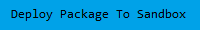

# Extra Code Coverage

This plugin used to include test files that were not included as part of the base Apex Rollup package. As the base package now includes all of the tests that this package used to include, it is no longer necessary and will cease to be maintained.

In order to ensure backwards compatibility for organizations that already have this plugin package installed, a new version with a simple empty test class is included - organizations can upgrade this plugin package, and then update to the latest version of Apex Rollup without issue.
