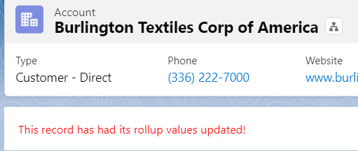

# Rollup Callback Plugin

<a href="https://login.salesforce.com/packaging/installPackage.apexp?p0=04t6g000008Sis0AAC">
  
</a>

<a href="https://test.salesforce.com/packaging/installPackage.apexp?p0=04t6g000008Sis0AAC">
  
</a>

## Why Use This Plugin

If you're reading this asking: _what's a callback?_ or: _how does this make my life easier?_

Those are both good questions - and they deserve good answers. "Callbacks," as a programming mechanism, were popularized by the JavaScript programming language (and stems, etymologically, from auditioning for roles in theater/movies - the "call back," then was in reference to hearing the good news via phone that you'd gotten a part). While JavaScript has spent the past few years moving away from the callback syntax, it's perfect for our use-case - giving disparate parts of our Salesforce system the ability to opt-in to notifications regarding records being updated. To that end, a Platform Event (Rollup Callback Event; more on this below) is included with this plugin's implementation.

There are a plethora of ways the built-in Rollup Callback Event might be of use to you. Here's a simple example that draws upon a Lightning Web Component (LWC) to display a warning to users concerning rollup updates:

At the moment, it isn't possible to listen for a platform event with a Screen Flow, so the following is only achievable with a LWC, but it's my hope that at some point you'll be able to use a Screen Flow to achieve the same thing as this extremely simple example: a LWC that notifies a user that the record page they're on has had rollup values updated:

```javascript
// in rollupChangeNotifier.js
import { api, LightningElement } from 'lwc';
import { subscribe } from 'lightning/empApi';

export default class RollupChangeNotifier extends LightningElement {
  @api
  recordId;

  hasUpdated = false;

  connectedCallback() {
    subscribe('/event/RollupCallbackEvent__e', -1, response => {
      this.hasUpdated = response.data.payload.RecordIds__c.split(',').filter(potentialRecordId => potentialRecordId == this.recordId).length > 0;
    });
  }
}
```

```xml
<!-- in rollupChangeNotifier.js-meta.xml -->
<?xml version="1.0" encoding="UTF-8"?>
<LightningComponentBundle xmlns="http://soap.sforce.com/2006/04/metadata">
    <apiVersion>62.0</apiVersion>
    <isExposed>true</isExposed>
    <masterLabel>Rollup Change Notifier</masterLabel>
    <targets>
        <target>lightning__RecordPage</target>
    </targets>
</LightningComponentBundle>
```

```html
<!-- in rollupChangeNotifier.html -->
<template>
  <template if:true="{hasUpdated}">
    <div style="color: red; background-color: white; padding: 1rem">This record has had its rollup values updated!</div>
  </template>
</template>
```

Which produces something like this:



## Usage

Once you have the plugin installed, you have multiple options for interacting with the updated parent-level records.

1. Let the vanilla `RollupDispatch` implementation fire off a platform event (`RollupCallbackEvent__e`) which you can listen for and respond to in Apex, Flows, LWC, etc (this is how the above example works) ... this platform event includes a field, `RecordIds__c` that contains a comma-separated list of all the updated parent records. This event fires by default any time record updates through `Rollup` are made, but can be prevented from firing by:

- deleting the `Should Fire Platform Event` Rollup Plugin Parameter associated with the `Rollup Dispatcher` Rollup Plugin CMDT record
- updating said record's `Value` field to `false`

2. You can also choose to add your own callback implementations by adding additional `Rollup Plugin Parameter` entries off of the `Rollup Dispatcher for Rollup Callback` Rollup Plugin Custom Metadata record. To do so, implement the `RollupSObjectUpdater.IDispatcher` interface:

```java
public interface RollupSObjectUpdater.IDispatcher {
  void dispatch(List<SObject> records);
}
```

Implementing this interface gives you something that the Rollup Callback Event can't - direct access to the parent records _and_ their updated rollup fields.

Here's an example implementation that fires off a subflow for you where:

- `SubflowRollupDispatcher` would be the Value filled out on a new `Rollup Plugin Parameter` associated with the `Rollup Dispatcher for Rollup Callback` Rollup Plugin CMDT record
- you had a subflow set up called `RollupSubflow` that had a collection input variable called `records` which conformed to an Apex-Defined Type, `SObjectDecorator` (note: this is a somewhat contrived example; it's my hope that Flows will support generic SObjects as input parameters; in the meantime, an Apex-Defined Type is as close as we can get).

```java
public class SObjectDecorator {
  @AuraEnabled
  public String SObjectName;
  @AuraEnabled
  public String RecordId;
  @AuraEnabled
  List<String> FieldNames;
}
public class SubflowRollupDispatcher implements RollupSObjectUpdater.IDispatcher {

  public void dispatch(List<SObject> records) {
    List<SObjectDecorator> wrappedRecords = new List<SObjectDecorator>();
    for (SObject record : records) {
      SObjectDecorator decorator = new SObjectDecorator();
      decorator.SObjectName = record.getSObjectType().toString();
      decorator.RecordId = record.Id;
      decorator.FieldNames = new List<String>(record.getPopulatedFieldsAsMap().keySet());
      wrappedRecords.add(decorator);
    }
    Flow.Interview rollupSubflow = new Flow.Interview.RollupSubflow(
      new Map<String, Object>{
        'records' => wrappedRecords
      }
    );
    rollupSubflow.start();
  }
}
```

These examples are just barely brushing the surface for how post-processing might be accomplished within your org. As a reminder, unless your `Org Default` Rollup Control CMDT record has its `Should Run As` field set to run synchronously, all Rollup updates will happen in an async context. If you make use of the Rollup Callback Event platform event, you'll be responding to changes in an async fashion as well.
